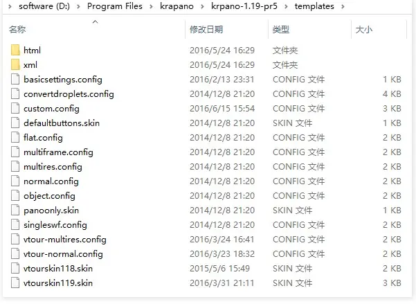
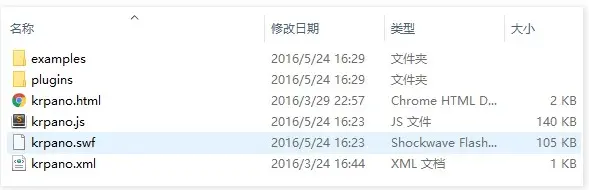
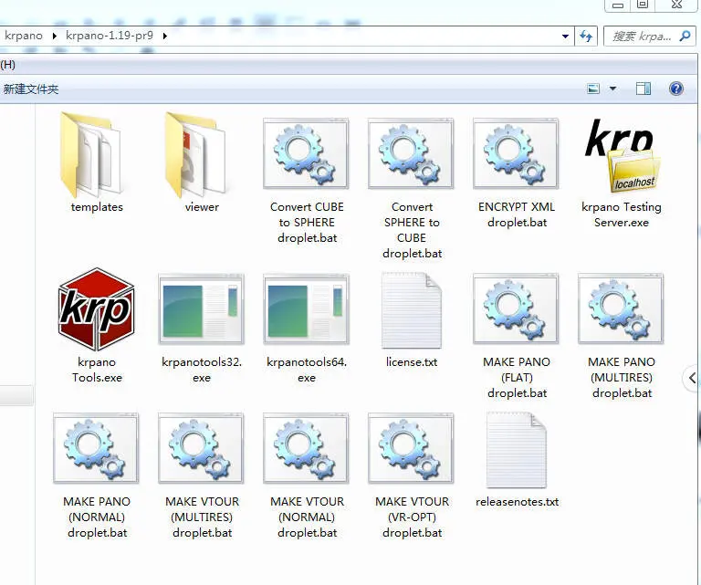
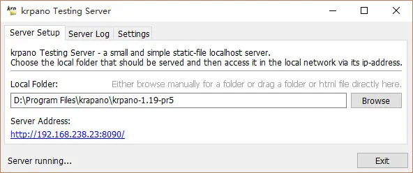
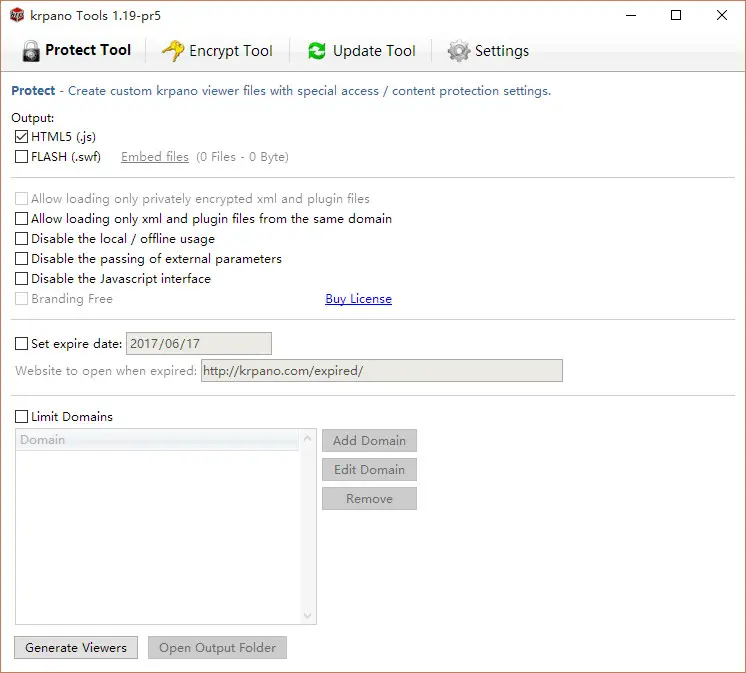
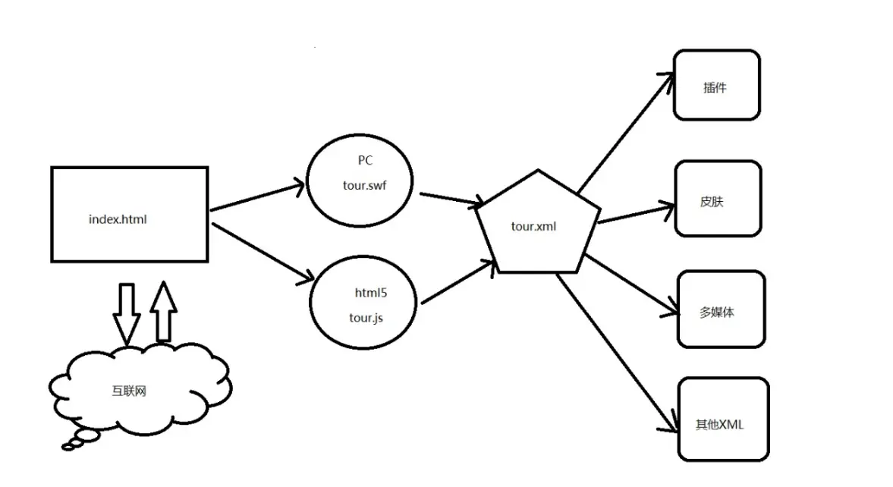

## 文件说明

### 下载包使用说明

#### examples文件夹

<p>这是krpano的案例文件夹<span style="color: #ff0000;">（1.19的examples文件夹在viewer文件夹下）</span>，里面包含了官方的绝大部分案例，这些案例都是学习krpano代码的很好的素材。注意下载包的案例所使用的viewer是下载包自身的默认viewer文件夹。因为你不能简单复制案例文件夹，你还需要设置一下对应viewer的路径，而且该viewer还必须是你自己的viewer。</p>

#### templates 文件夹

官方一系列模版所在的文件夹，包括了图片、xml、html以及相关配置文件等。通过对这里的了解和修改，我们可以做出自己的皮肤模版，然后一键生成，实现批量的工作流。当然，正常情况下，你也无需从这里拷贝，因为在droplet过程中会自动生成。部分模版在默认droplet过程中并没有使用到。



#### viewer 文件夹


krpano 下载包的官方插件、引擎、案例的存放位置，同时也是让案例文件夹能够正确显示的 viewer 所在的位置。其中plugins是当前版本的所有官方插件；examples是官方提供的案例。

**小贴士**

自身项目的 viewer（js和swf）会在droplet过程中自动生成无需从这里拷贝

#### droplet.bat 文件

Krpano Droplets 是krpano命令行工具加上配置文件config的一个快捷方式。droplets使用方式非常简单，将文件（通常是图片或者xml等文件）直接拖放在droplet图标上松开即可。


krpano droplet （图中齿轮状图标文件）

**MAKE PANO (NORMAL) Droplet**

用法说明:

*   生成普通 (=单分辨率) 全景.
*   制作典型的360度全景.
*   全部全景图将会一次性载入. 默认下方块最大边长为2048像素(可以在config配置文件中修改).
*   包括默认的导航皮肤.
*   支持Flash和HTML5.

Droplet 说明:

*   基于kmakemultires工具.
*   配置文件:normal.config
*   默认模版/皮肤配置文件:defaultbuttons.skin

**MAKE PANO (MULTIRES) Droplet**

用法说明:

*   生成多分辨率全景
*   制作所有类型的全景
*   只有特定的切片在需要时载入. 没有尺寸/分辨率限制.
*   包含默认的导航皮肤.
*   支持Flash和HTML5.

Droplet 说明:

*   基于kmakemultires工具.
*   配置文件:multires.config
*   默认模版/皮肤配置文件:defaultbuttons.skin

**MAKE PANO (SINGLESWF)Droplet**

用法说明:

*   生成普通 (=单分辨率) 全景同时将所有文件嵌在一个SWF文件中.只输出一个SWF文件和一个HTML文件.
*   制作典型的360度全景 .
*   全部全景图将会一次性载入. 默认下方块最大变长为2048像素(可以在配置文件中修改).
*   包含默认的导航皮肤.
*   仅支持Flash.

Droplet 说明:

*   基于kmakemultires工具.
*   配置文件:singleswf.config
*   默认模版/皮肤配置文件:defaultbuttons.skin

**MAKE PANO (FLAT)Droplet**

用法说明:

*   生成平面切片多分辨率图像.
*   制作平面图像. 输出时既定为平面图像.
*   只有特定的切片在需要时载入. 没有尺寸/分辨率限制.
*   包含有默认导航按钮的皮肤，针对特定的视角.
*   支持Flash与HTML5.

Droplet 说明:

*   基于kmakemultires工具
*   配置文件:flat.config
*   默认模版/皮肤配置文件:flat.xml / flatskin.xml

**MAKE VTOUR (NORMAL)Droplet**
用法说明:

*   生成普通 (=单分辨率) 全景并将它们整合到一个虚拟漫游中.
*   制作典型的360度全景.
*   全部全景图将会一次性载入. 默认下方块最大边长为2048像素(可以在配置文件中修改).
*   包含一个包括导航按钮、可滚动缩略图以及可选择必应地图以及重力感应插件的默认皮肤.
*   支持Flash和HTML5.

Droplet 说明:

*   基于kmakemultires工具.
*   配置文件:vtour-normal.config
*   默认模版/皮肤配置文件:vtourskin-thumbnails-bingmaps-gyro.skin

**MAKE VTOUR (MULTIRES)Droplet （正常生成不考虑VR的漫游推荐使用这个dropelt）**

用法说明:

*   生成多分辨率全景并将它们整合到一个虚拟漫游中.
*   制作所有类型全景图像.
*   只有特定的切片在需要时载入. 没有尺寸/分辨率限制.
*   包含一个包括导航按钮、可滚动缩略图以及可选择必应地图以及重力感应插件的默认皮肤.
*   支持Flash和HTML5.

Droplet 说明:

*   基于kmakemultires工具.
*   配置文件:vtour-multires.config
*   默认模版/皮肤配置文件:vtourskin-thumbnails-bingmaps-gyro.skin

**MAKE VTOUR (VR-OPT)droplet （正常生成带有VR的漫游推荐使用这个dropelt）**

用法说明:

*   生成多分辨率全景并将它们整合到一个虚拟漫游中.
*   制作所有类型全景图像.
*   只有特定的切片在需要时载入. 没有尺寸/分辨率限制.
*   包含一个包括导航按钮、可滚动缩略图以及可选择必应地图以及重力感应插件的默认皮肤.
*   支持Flash和HTML5.
*   krpano 1.19 pr9后，可生成为VR优化的全景图。如果包含立体图像的输入时，会生成针对VR使用的立体图像。

Droplet 说明:

*   基于kmakemultires工具.
*   配置文件:vtour-vr.config
*   默认模版/皮肤配置文件:vtourskin-thumbnails-bingmaps-gyro.skin

**MAKE OBJECTDroplet**

用法说明:

*   生成若干个平面多分辨率图像并将它们整合到一个可缩放旋转的360物体影像中.
*   制作平面图像物体. 所有物体图片的尺寸必须一致.
*   只有特定的切片在需要时载入. 没有尺寸/分辨率限制.
*   包含一个特定的控制物体的皮肤.
*   仅支持Flash.

Droplet 说明:

*   基于kmakemultires工具.
*   配置文件:object.config
*   默认模版/皮肤配置文件:object.xml / objectskin.xml

**Convert SPHERE to CUBEDroplet**

用法说明:

*   将球面图像转换至立方体图.
*   输出的立方体格式、尺寸以及图像尺寸可以在配置文件中修改.

Droplet 说明:

*   基于ktransform 工具.
*   配置文件: convertdroplets.config

**Convert CUBE to SPHEREDroplet**

用法说明:

*   将六张立方体图像转换成一张球面全景图.
*   输出的图像尺寸和格式可以在配置文件中修改.

Droplet 说明:

*   基于kcube2sphere工具.
*   配置文件: convertdroplets.config

**Encrypt XMLDroplet**

用法说明:

*   将xml文件拖放进droplet进行加密.
*   加密过程中xml文件会自动被压缩.

Droplet 说明:

*   基于encrypt工具.

**制作自定义droplet**

内置 droplets 只是针对最常见的情况的范例。制作自定义的krpano droplet是非常简单的。你只需要编辑配置文件，然后复制并重命名一个已有的krpano droplet并对droplet本身进行编辑即可。

*   Windows下编辑krpano droplet
*   krpano droplet实际上是批处理文件 (.bat).
*   可以在任意文本编辑器下进行编辑.
*   用文本编辑器打开krpano droplet，将配置文件的名字和路径修改为你自己的配置文件.
*   Mac OSX下编辑krpano droplet
*   droplet实际上是”AppleScript Droplet’.
*   可以使用 ‘Apple Script Editor’打开
*   在 Apple Script Editor打开krpano droplet，将配置文件的名字和路径修改为你自己的配置文件.

#### 两个txt文件

krpano授权的法律声明以及版本发行说明。

#### krpanotools

包含 32/64 位的 krpanotools32.exe 与 krpanotools64.exe，该两个文件为 krpano 项目核心，会在命令行中调用它们。

#### krpano Testing Server

krpano 自带的静态文件本地服务环境，使用它可以路过本地文件案例限制来查看 Flash 与 HTML5 效果，另外它还可以控制浏览器缓存、限制下载速度模拟网络条件。



#### krpano tools

用来加密保护全景项目的可视化工具，需要注册才可以使用，这里就不扩展。



### 成果文件说明

#### vtour 文件夹结构

以下是默认与比较基础文件结构与文件名，根据droplet的不同，文件可能更多或更少，同时文件名也并不一定和这些一样。

```
vtour/
  |-- panos/             #存放全景切片图片的文件夹
  |-- skin/              #存放皮肤相关文件
  |-- plugins/           #用来存放插件
  |-- tour.swf           #krpano flash viewer
  |-- tour.js            #krpano HTML5 viewer
  |-- tour.xml           #生成全景的相关配置
  |-- tour.html          #用来浏览全景的页面，需要本地服务环境
  |-- tour_editor.html   #添加热点（hotspot）与初始化视角设置的编辑器
  |-- tour_testingserver.exe #windows系统中打开测试服务器并打开html文件进行本地浏览。
  |-- tour_testingserver_macos #mac系统中打开测试服务器并打开html文件进行本地浏览。
```

#### vtour 运作机制

Krpano 是通过viewer引擎来实现浏览静态图片时产生“三维”效果，而这一切则是通过tour.html这个入口文件。

过滤掉一些没用的代码，可以看到入口文件主代码如下：

```html
<div id="pano"></div>
<script src="tour.js"></script>
<script>
embedpano({
  swf: "tour.swf", //有则表示加载flash引擎，如果设置html5:only则不需要该值
  xml: "tour.xml", //启动时的配置文件
  target: "pano", //要渲染到的目标容器ID
  html5: "only", //如果有需要用到flash，可设置为auto
  //id: "krpanoSWFObject", //默认的krpano对象，每一个viewer对应唯一id，与JS交互时要用到
  mobilescale: 1.0, //移动设备缩放，1表示不缩放，默认0.5
  passQueryParameters: false //是否接受URL传参，例如：tour.html?html5=only&startscene=scene2
});
</script>
```


