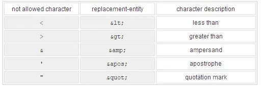

## Krpano XML 语法

**krpano xml**

xml本身是一种**传输格式**，这意味着只能用于在krpano viewer内传输数据。当xml被解析时，xml元素才会被传输/映射到krpano的内部数据结构。这就是说当解析结束后，本质上就再也没有xml。

krpano xml 本身是xml 语言，但有着自己特定的元素和语法。krpano xml 包括静态代码和动态代码部分。

静态代码就是由 26 个krpano 元素（包含废弃的两个）组成的代码，它们有着自己的属性，通常属性的值都是字符串或者数字或者是布尔值，因为这些属性的默认值规定了只能用这些类型。

相关的数值类型包括 string （字符串）、number （浮点数）、int（整数）、boolean （布尔
值， true 或者false ）。

*   有些属性只在 Flash 下有意义，例如`layer[name].smoothing`;
*   有些属性只在 HTML 下有意义，例如`layer[name].jsborder`
*   有些属性是只读属性， 你不能就这样写在上面的静态代码中， 只能通过get() 来获取其数值，

如`layer[name].pressed 、layer[name].imagewidth 、layer[name].imageheight`

*   还有一些属性是比较特别的，他们的数值类型是 Action Event 、也就是属性的数值实际上是填入动态代码，例如我们一开始遇到的`onclick ="openurl('http://...');"`，类似的还有几个 on 字辈的属性，像

```
onover =""
onhover =""
onout =""
onclick =""
ondown =""
onup =""
onloaded =""
```

**xml标签/节点**

```xml
<element /> //无子元素
<element></element> //有子元素
```

**属性**

一个xml元素可以有一个或多个属性,由属性名和属性值构成，属性值必须放在单引号或者双引号中，且属性不允许重复

```xml
<element attribute="value">
    <childrenelement test1="value1" test2="value2" />
</element>
```

**根元素krpano**

所有元素需要位于krpano元素内部

```xml
<krpano onstart="...">
    ...
    <preview url="..." />
    <image>
      <cube url="..." />
    </image>
    ...
</krpano>
```

**注释**

不能包含两个连字符--
`<!-- -->`
**大小写**
xml元素的名称和xml属性都会被转换成小写，所以是不区分大小写的
**编码**
为了避免字符编码问题，所有xml文件应保存为utf-8或utf-16文件
**自定义元素**
krpano允许添加自定义的元素、允许在系统定义的元素中添加自定义属性，方便我们进行其它操作。krpano在载入xml文件解析静态代码时会忽略掉自定义元素。自定义的元素和属性除了语法上不能违反krpano的规定，在属性值设置上更为自由。
**其他**
xml元素间的空格字符空格、制表符和换行符将被忽略

保留字，不能直接使用，需要使用转义



出现相同name的元素后面会覆盖前面的

注意：html5模式会比flash模式严格，两种模式均需调试

---

官方文档：https://krpano.com/docu/xml/syntaxrules/#top
