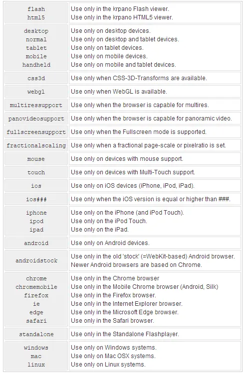
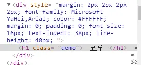

## Krpano XML 内置元素

krpano的XML结构

```xml
<krpano>
    <include>
    <preview>
    <image>
    <view>
    <autorotate>
    <plugin>
    <layer>
    <hotspot>
    <events>
    <action>
    <scene>
</krpano>
```

krpano xml中的所有xml元素和属性是可选的,可以定义多次。 当相同的元素将再次定义两个或两个以上的时候,那么以后/声明 将会覆盖之前的。

< krpano > 根元素内 也可以包含< krpano > 元素

xml本身只是一个 传送格式 ——这意味着它将只用于传送krpano view的数据。 当xml解析,那么xml元素将转换/映射到krpano内部数据结构。 这意味着xml解析后就没有了。

官方文档：https://krpano.com/docu/xml/

### 特殊属性

#### name

```xml
<xmlelement name="..." ... />
```

name属性 ⇒定义Array元素:

当一个xml元素有name属性,那么这个元素将被解释为元素的Array 。 neme名字的 Array 即是该元素本身。

当没有 Array 这个名字已经存在,它将被自动创建。

当元素已经存在,然后被定义 xml元素将仍然创建，但会覆盖已经存在的元素。

**名称属性名字规范：**

1.  必须以英文字母开始，不能使用数字，汉字开始 !
2.  当一个名称仍以数字字符开始，然后将解释为Array索引名称。
3.  所有名称会自动转换成小写,允许直接不分大小写访问!

#### url

```xml
<xmlelement url="..." ... />
```

资源路径，用于引入插件、图片、音频等。

更以根据需要使用下面的占位符：

```
%FIRSTXML% – 第一个载入的xml文件的路径。
%CURRENTXML% – 当前载入的主xml文件路径（非嵌入的文件）。
%SWFPATH% – viewer文件的路径。
%HTMLPATH% -html文件的路径。
%BASEDIR% – 使用basedir的路径。
%$VARIABLE% – 使用指定的“VARIABLE” – 这可以是任意的krpano变量，但必须当前xml或场景完全载入之前定义，例如已经存在于HTML文件中或在loadpano()、loadscene()调用之前。
```

#### devices

```xml
<xmlelement ... devices="...">
    <childrenelement ... />
    ...
</xmlelement>
```

如果xml元素在某个设备渲染或者忽略，可以给该元素设置devices属性，可以设置多个。它可以在每个xml元素上设置，当xml文件将被解析并转换为krpano内部数据结构时,将会检查每个xml元素的devices属性。当当前设备不匹配devices属性,那么这个xml元素及其所有子元素将被忽略。

```
+  .and.  且
|  .or.   或
！  no-   否
```

属性值（可以通过逻辑运算符组合使用）



例子

```
devices="all"（默认）
devices="html5"
devices="flash|webgl"
devices="flash.or.webgl"
```

#### attribute.devicecheck

```xml
<xmlelement attribute.devicecheck="..."
            attribute.devicecheck="..."
            ...
            />
```

在不同中设置不同的属性值，属性值同device

```
+  .and.  且
|  .or.   或
！  no-   否
```

例子

```
    scale.normal="1.0"
    width.desktop="200"
    visible.fullscreensupport="true"
    visible.html5.and.webgl.or.flash="true"
    visible.html5.and.no-webgl="false"
```

#### if

```xml
<xmlelement ... if="condition">
    <childrenelement ... />
    ...
</xmlelement>
```

根据条件渲染元素

例子

```xml
embedpano({..., initvars:{design:"flat"}, ...});
<include url="design_default.xml" if="design == default" />
<include url="design_flat.xml"    if="design == flat"    />
```

#### style

```xml
<style name="stylename" attributes ... />
<xmlelement ... style="stylename" ... />
```

调用styleneme属性集，并应用到该元素，优先级低于行间，可用行间属性覆盖

例子

```xml
<style name="spotstyle" url="spotimage.png" />
<hotspot name="spot1" style="spotstyle" ... />
<hotspot name="spot2" style="spotstyle" ... />
```

#### get、calc

```xml
<xmlelement attribute="get:variable" ... />
<xmlelement attribute="calc:expression" ... />
```

获取、计算属性值

例子：

```xml
<settings width="100" height="50" />
...
<layer ...
        width="get:settings.width"
        height="calc:settings.height * 2"
        />
```

#### keep

场景之间的转换时（包括场景内外的切换），layer元素、hotspot元素以及events元素是否保留，默认为false。

注：

*   我们平常实际上每个项目开始时都是先从scene之外到scene内，所以一开始就有场景的切换。因此说，你写在scene外面的layer元素、hotspot元素以及event元素，你应该设置一个keep=”true”，才能够让场景切换时这些元素或事件不会移除。
*   静态元素会继承父元素的keep属性；动态创建的为false，不会继承。

### krpano

krpano 根元素,当xml进入解析数据结构阶段，会将该标签移除，你可以在当前krpano内定义另外的krpano

```xml
<krpano version="1.19"     //版本号
        onstart=""         //进入漫游时，xml加载和解析后执行的动作
        basedir="%FIRSTXML%" //设置程序根目录
        bgcolor=""      //全景播放器的背景色，不设置则为透明
        idletime="0.5"  //无用户交互操作的多长时间后执行onidle动作
        colorcorrection="default" //改变Flashplayer 10的色彩修正设置(Flash only)　可选的值：default、on、off
        logkey="true"     //当为Ture时，按O可查看log日志
        strict="false"            //严格代码模式
        showerrors="true"  //是否输出错误信息
        debugmode="false"  //当为True时，显示来自插件中的trace(0,text)中的text信息
    >
    ...
</krpano>
```

krpano作为XML文件唯一根元素，必须设置！

**进阶提示** – 当xml进入解析数据结构阶段，则主标签“krpano”将被移除。所以你可以在当前krpano标签内定义另一个krpano元素，定义新的设置或重新定义先前的设置。

样例：

```xml
<krpano>
<!-- 仅仅使用网格预览全景(节约下载空间-->
<preview type="grid(cube,16,16,512,0xCCCCCC,0xFFFFFF,0x999999);"
details ="16" />
</krpano>
```

`grid(type，xsteps，ysteps，res，lincol，bkcol，pntcol)` 可选参数： xsteps =行像素之间的水平距离，默认= 10 ysteps =行像素之间的垂直距离，默认= 10 res =解决 gridimage，默认= 400 lincol = hex-format 线条的颜色(默认= 0 x666666) bkcol =背景颜色(默认= 0 x222222) pntcol =点的颜色(默认= linecolor)

```xml
<krpano version="1.17" onstart="loadscene(scene1);">
  <scene name="scene1">
  ...
  </scene>
</krpano>
```

### preview

preview 预览图设置，指定一张全景预览图，以便在读取过程中，过渡显示，即全景完全载入之前的模糊图像，一般自动生成

```xml
<preview type=""                   //全景图的类型（SPHERE，CYLINDER，CUBESTRIP，grid(type,xsteps,ysteps,res,linecol,bgcol,pntcol) ）
          url="previewpano.jpg"  //全景图路径
          striporder="LFRBUD"       //定义图像顺序
          details="16"              //图像细节质量调整，越大越清晰
          />
```

样例：

```xml
<preview url="pano_preview.jpg" />
<preview type="grid(CUBE,16,16,512,0xCCCCCC,0xFFFFFF,0x999999);" />
<preview type="SPHERE" url="spherepreview.jpg" details="16" />
<preview type="CUBESTRIP" url="cspreview.jpg" />
```

### image

\*image全景图设置，包括全景图类型、渐进分辨率切片显示等

```xml
<image type="CUBE"                全景图类型（六面体）CUBE、CUBESTRIP、SPHERE、CYLINDER
        tiled="false"              是否使用平铺图像
        tiledimagewidth="..."      平铺图像宽度
        tiledimageheight="..."     平铺图像高度
        tilesize="..."             平铺图像大小
        baseindex="1"              图像读取默认索引数字(第一个)
        frames="1"                 当前图像帧数
        frame="1"
        prealign=""                prealign,采用X|Y|Z轴对齐方式
        hfov=""                    水平视野
        vfov=""                        垂直视野
        multires=""                   多级精度
        multiresthreshold=“0.025”
        stereo=""                    立体
        stereolabels=""
        stereoformat=""
        fisheye.fov=""                鱼眼
        fisheye.align=""
        fisheye.crop=""
        fisheye.lenscp=""
        voffset=“0.0” 垂直偏移度
        progressive=“false” 多分辨率加载（仅限flash）
        cubelabels=“u‘b r f l | | | | | d‘”
        sphere.mapping  定义/投影球面输入图像的映射（仅限html5）
        mjpegstream    mjpeg流(只支持HTML5和WebGL)
      >
        <cube url="pano_%s.jpg" />
</image>
```

以上是数字索引方式读取切片图片，以下是通过定义六个方向的图片路径读取切片，文件后缀要加上\_l，\_f....方式来识别。
相关方法

```
image.layer   仅限as3 usage
image.level.count   只读
level[..].tiledimagewidth
level[..].tiledimageheight
level[..].tilesize
level[..].aspreview
```

```xml
<image type="CUBE"
        tiled="false"
        tiledimagewidth="..."
        tiledimageheight="..."
        tilesize="..."
        baseindex="1"
        frames="1"
        frame="1"
        prealign=""
  >
    <left  url="pano_l.jpg" rotate="0" flip="" />
    <front url="pano_f.jpg" rotate="0" flip="" />
    <right url="pano_r.jpg" rotate="0" flip="" />
    <back  url="pano_b.jpg" rotate="0" flip="" />
    <up    url="pano_u.jpg" rotate="0" flip="" />
    <down  url="pano_d.jpg" rotate="0" flip="" />
</image>
```

例子

```xml
<image>
    <cube url="pano_%s.jpg" />
</image>
```

<!-- -->

```xml
<image>
    <cubestrip url="cubestrip.jpg" />
</image>
```

<!-- -->

```xml
<image type="SPHERE" multires="true" tilesize="...">
  <level tiledimagewidth="..." tiledimageheight="...">
    <sphere url="pano_%v_%h.jpg" />
  </level>
</image>
```

<!-- -->

```xml
<image type="CYLINDER" multires="true" tilesize="...">
  <level tiledimagewidth="..." tiledimageheight="...">
    <cylinder url="pano_%v_%h.jpg" />
  </level>
</image>
```

<!-- -->

```xml
<image>
    <fisheye url="fisheye.jpg" fov="180.0" />
</image>
```

<!-- -->

```xml
<image type="CYLINDER" hfov="1.0" multires="true" tilesize="...">
  <level tiledimagewidth="..." tiledimageheight="...">
    <cylinder url="image_%v_%h.jpg" />
  </level>
</image>
```

<!-- -->

```xml
<plugin name="video"
        url.flash="videoplayer.swf"
        url.html5="videoplayer.js"
        videourl="video.m4v|video.webm"
        />
<image>
    <sphere url="plugin:video" />
</image>
```

### view

view 元素控制全景的视野，例如起始位置、视域范围、可缩放范围、是否限制，限制观看的区域等等。当要设置限制视角或设定特定的初始视角时，需要自行设定或使用插件获取代码。

观看方向由hlookat/vlookat属性定义，当前视场由fov属性定义。要限定部分全景的视场，可以使用limitview属性。

```xml
<view hlookat="0.0"    水平视角  -180 至  180 之间
      vlookat="0.0"    垂直视角  -90  至  90  之间
      camroll="0.0"    镜头旋转视角
      fovtype="VFOV"   定义视场角类型

•vfov -垂直视场，基于屏幕的高度
•HFOV -水平视野，基于屏幕宽度
•DFOV -看对角线场，基于屏幕的对角线
•MFOV -最大的视场（动态混合vfov和HFOV）

注意：在手机和平板设备的默认值将MFOV！


      fov="90.0"        默认视角的缩放
      hfov="" 当前水平视野（只读）
    vfov="" 当前垂直视野（只读）
      fovmin="1.0"      默认视角缩放最大值
      fovmax="179.0"    默认视角缩放最小值
      maxpixelzoom=""   默认视角最大缩放倍数
      mfovratio="1.333333" 最大的屏幕尺寸的宽高比例
      distortion="0.0"                鱼眼视角失真设置 0.0 至  1.0 之间（扭曲程度）
      fisheye="0.0"     #鱼眼视角设置 0.0 至  1.0 之间（扭曲程度）（旧）
      distortionfovlink="0.5"    fov值与鱼眼视角的关联值，默认0.5(0.0-3.0之间)
      fisheyefovlink="0.5"  #fov值与鱼眼视角的关联值，默认0.5(0.0-3.0之间)（旧）
      stereographic="true" 是否启动立体鱼眼投影效果（小行星）
      pannini="0.0"       设置“Pannini / vedutismo”投影效果
      architectural="0.0"   建筑视角设置 0.0 至  1.0 之间
      architecturalonlymiddle="true"  是否只对中间区域的图像实行建筑投影
      limitview="auto"    视角限制类型

•off--不限制在所有
•auto--自动限制（默认）
•lookat--限制查看变量直接“hlookatmin”，“hlookatmax”，“vlookatmin”，“vlookatmax”
•range--限制的地区设置由“hlookatmin”，“hlookatmax”，“vlookatmin”，“vlookatmax”，只有在这个范围内，允许观察
•fullrage--的地区设置由“hlookatmin”，“hlookatmax”，“vlookatmin”，“vlookatmax”，但允许放大看到整个图像
•offrange---限制的地区设置由“hlookatmin”，“hlookatmax”，“vlookatmin”，“vlookatmax”，但不以任何方式限制缩放。


      hlookatmin=""   最小水平视角范围  (-180 .. +180).
      hlookatmax=""   最大水平视角范围  (-180 .. +180).
      vlookatmin=""   最小垂直视角范围  (-90 .. +90).
      vlookatmax=""   最大垂直视角范围  (-90 .. +90).
      hlookatrange=""(只读)  当前最大水平范围（等同于 hlookatmax - hlookatmin）
    vlookatrange=""（只读）当前最大垂直范围(等同于vlookatmax - vlookatmin)
      />
```

默认视角的参数设置和视角限制设置

样例：

normal: `<view hlookat="0" vlookat="0" fov="80" />`

little planet view:

```xml
<view hlookat="0"
      vlookat="90"
      fisheye="1.0"
      stereographic="true"
      fov="150"
      fovmax="150"
      />
```

flat pano:

```xml
<view hlookat="0"
      vlookat="0"
      maxpixelzoom="1.0"
      limitview="fullrange"
      />
```

### area

area 全景图在浏览器中的显示区域大小， 定义全景图像展示的区域/窗口。有两种定义区域位置和尺寸的模式：

*   通过定义尺寸和位置 (mode=align)
*   定义边界边距 (mode=border)

可在onresize事件中动态改变/调整这些设定。如果在onresize事件之外改动了area设置，那么在下一次屏幕刷新时候将会调用一个onresize事件，对于新的区域/窗口尺寸作出回应。

**注意** – 所有的`<layer> / <plugin>`元素都要放在这个区域内。如果要把`<layer> / <plugin>`元素放在区域外面，需设置layer/plugin的STAGE属性。

**对齐方式:**

```xml
<area mode="align"           定义区域的模式，排列align和边界border两种　可选的值：align、border
      align="lefttop"    排列对齐时[X,Y]的坐标参考系　可选的值：lefttop、left、leftbottom、top、center、bottom、righttop、right、rightbottom
      x="0"                  基于排列方式偏移的X坐标
      y="0"                  基于排列方式偏移的y坐标
      width="100%"           区域宽度，可以是像素值也可以是百分比
      height="100%"          区域高度，可以是像素值也可以是百分比
      />
```

**边界填充模式:**

```xml
<area mode="border"          定义区域的模式：边界
      left="0"           距左边的像素数
      top="0"                距顶部的像素数
      right="0"              距右边的像素数
      bottom="0"             距底部的像素数
      />
```

样例：

\`<area align="center" width="640" height="480" />
<area mode="border" top="10" bottom="100" />
<area x="25%" width="75%" />
<events onresize="fixaspectresize(16,9);" />\`

### display

\*display 全景图显示品质，定义渲染的质量和性能

**html5状态下显示质量设置**

```xml
<display  stereo="false"  立体
          stereooverlap="0.0"
            hardwarelimit=""      限制只对目标硬件输出
              • Desktop(桌面) with WebGL - 4096
              • Desktop with CSS3D - 2560
              • Android / BlackBerry / Kindle / Windows Phone - 1024
              • iPad - 1024
              • iPhone (Retina) with iOS 5.1 (or higher) - 1024
              • iPhone 5/5S and higher - 1024
              • iPhone (Retina) with iOS below 5.1 - 800
              • iPod (Retina) - 640
              • iPhone / iPod Touch (Non-Retina) - 600
          usedesktopimages=""    设置是否在PC桌面使用html5输出
          mipmapping="auto"      定义切片输出模式，可选的值：auto、force、off
          loadwhilemoving="auto" 控制在移动时平滑显示模式（auto\true\false）
          framebufferscale="1.0"   调整/规模WebGL帧缓冲区的大小。
/>
```

**flash状态下显示质量设置**

```xml
<display fps="60"               flash播放时的帧速率，默认为60（30-100）
          details="24"           细碎程度,数值越高,Flash渲染越细腻(Flash only)
          tessmode="-1"          设置Flash材质排列方式,-1表示自动(球体时为0;立方体时为3)(Flash only)　可选的值：-1、1、2、3、4、5
          movequality="LOW"      移动时呈现质量(Flash only)　可选的值：LOW、HIGH、BEST、HIGHSHARP
          stillquality="HIGH"   静止时呈现质量(Flash only)　可选的值：LOW、HIGH、BEST、HIGHSHARP
          flash10="on"           启动flash10渲染，该项启动后上两项（movequality、stillquality）设置无效
          movequality10="HIGH"  移动时呈现质量(Flash10使能时有效)(Flash only)　可选的值：LOW、HIGH、BEST、HIGHSHARP
          stillquality10="HIGH"  静止时呈现质量(Flash10使能时有效)(Flash only)　可选的值：LOW、HIGH、BEST、HIGHSHARP
          sharpen="12"           图像锐化程度,仅当影像品质为HIGHSHARP时有效,值域0-14(Flash only)
          stilltime="0.25"       从 “移动改变到静止”之前的等待时间(Flash only)
          showpolys="false"      显示3D几何形状线条(Flash only)
          />
```

样例：

```xml
<display flash10="off" details="28" />
<display flash10="off" stillquality="HIGHSHARP" />
<display html5rendermode="1" devices="iPad+Retina" />
<display hardwarelimit="512" devices="Android" />
<display usedesktopimages="true" hardwarelimit="1800" devices="iPad+Retina+iOS6" />
```

### control

control 设置鼠标、键盘及触摸设备对全景浏览的控制方式

```xml
<control usercontrol="all"   用户控制方式（all,mouse,keyb,off）
          mouse="drag"                控制方式（drag，moveto，drag3d（仅限flash））
          touch="drag"                控制方式（drag，moveto，drag3d（仅限flash））
          dragrelative="true"    参数设置
          draginertia="0.1"            惯性
          dragfriction="0.9"            摩擦力
          drag_oldmode="false"        旧模式（html5）
          movetorelative="true"    参数设置
          movetoaccelerate="1.0"        加速度
          movetospeed="10.0"            最大速度
          movetofriction="0.8"            摩擦力
          movetoyfriction="1.0"        垂直摩擦力
          keybaccelerate="0.5"        加速度
          keybspeed="10.0"                速度
          keybfriction="0.9"                    摩擦力
          keybinvert="false"                    反转
          keybfovchange="0.75"        按钮改变视角
          mousefovchange="1.0"        鼠标滚轮改变视角
          fovspeed="3.0"        改变视角速度
          fovfriction="0.9"    改变摩擦力
          zoomtocursor="false" 放大
          zoomoutcursor="true"    缩小
          touchzoom="true"    手势缩放
          keycodesleft="37"     左键
          keycodesright="39" 右键
          keycodesup="38" 上键
          keycodesdown="40"  下键
          keycodesin="" 放大键
          keycodesout="" 缩小键
          keydownrepeat="true"  连续按键
          bouncinglimits="false" 反弹（仅限html5）
          />
```

```xml
<control mouse="drag"
          touch="drag"
          dragrelative="true"
          draginertia="0.1"
          dragfriction="0.9"
          movetorelative="true"
          movetoaccelerate="1.0"
          movetospeed="10.0"
          movetofriction="0.8"
          keybaccelerate="0.5"
          keybspeed="10.0"
          keybfriction="0.9"
          keybfovchange="0.75"
          mousefovchange="1.0"
          fovspeed="3.0"
          fovfriction="0.9"
          zoomtocursor="false"
          zoomoutcursor="true"
          touchzoom="true"
          bouncinglimits="false"
          />
```

*   mouse、touch
*   drag - drag the pano image.
*   moveto - move the pano image.
*   drag3d - free-axis 3d dragging (Flash only)

鼠标键盘的控制设置

样例：

```xml
<control mousetype="drag2D" />
<cursors url="drag-cursors.png"
          type="drag"
          move="2|0|30|32"
          drag="37|0|30|32"
          />
<control mousetype="moveto" />
<cursors url="arrow-cursors.png"
          type="4way"
          move="112|0|28|28"
          drag="112|0|28|28"
          arrow_r="0|0|28|28"
          arrow_d="28|0|28|28"
          arrow_l="56|0|28|28"
          arrow_u="84|0|28|28"
          />
```

### cursors

cursors 鼠标光标样式
html5可以使用 standard, dragging and moving 调用系统样式，flash模式可以自定义图片

```xml
<cursors  standard="default"  标准
          dragging="move"  拖动
          moving="move"  移动
        url=""            光标图片地址
          type="8way"       光标方向模式，是4个方向移动更换图片，还是8个方向移动都更换图片（drag，4way，8way）
          move=""           设定光标移动时显示图片
          drag=""           设定鼠标按下时显示图片
          arrow_l=""        以下是8个方向移动时对应显示的鼠标图片
          arrow_r=""
          arrow_u=""
          arrow_d=""
          arrow_lu=""
          arrow_ru=""
          arrow_ld=""
          arrow_rd=""
          />
```

自定义光标的样式
样例：

```xml
<control mousetype="drag2D" />
<cursors url="drag-cursors.png"
          type="drag"
          move="2|0|30|32"
          drag="37|0|30|32"
          />
<control mousetype="moveto" />
<cursors url="arrow-cursors.png"
          type="4way"
          move="112|0|28|28"
          drag="112|0|28|28"
          arrow_r="0|0|28|28"
          arrow_d="28|0|28|28"
          arrow_l="56|0|28|28"
          arrow_u="84|0|28|28"
          />
```

### autorotate

autorotate 自动旋转

```xml
<autorotate enabled="false"     是否开启自动旋转
            waittime="1.5"      用户不对屏幕操作后，开始自动旋转的等待时间
            accel="1.0"         旋转加速度：角度/秒
            speed="10.0"        自动旋转速度：角度/秒
            horizon="0.0"      例如-45表示向上45度仰视;45表示向下45度俯视
            tofov="off"         缩放到特定的视区
            zoomslowdown="true"   相对于当前的缩放/视场速度，减慢自动旋转速度，以获得相同的视觉速度在所有的缩放距离。
            interruptionevents="userviewchange|layers|keyboard"  定义哪些事件将中断自动旋转(以及onidle事件)，可以组合
            />
```

相关属性

```
autorotate.isrotating  是否旋转状态（只读）
autorotate.ispaused    是否停止状态（只读）
```

相关设置方法，事件

```
autorotate.start()  直接开始自动旋转(无需等待 autorotate.waittime)
autorotate.stop()    停止当前自动旋转并且禁用它
autorotate.interrupt() 中断自动旋转，但自动旋转功能自身仍然可用，会再过 autoratate.waittime 后自再次开始
autorotate.pause()    暂停自动旋转。例如当鼠标划过某个热点时就有必要让旋转暂停下来
autorotate.resume() 重启刚才暂停的旋转
```

```
onautorotatestart,
onautorotatestop,
onautorotateoneround
onautorotatechange
```

当无用户交互时．自动旋转、扭曲／移动，缩放

```
开始旋转：set(autorotate.enabled,true);
停止旋转：set(autorotate.enabled,false);
交替旋转：switch(autorotate.enabled);
```

样例：

```xml
<autorotate enabled="true" />
<autorotate enabled="true"
            waittime="5.0"
            speed="-3.0"
            horizon="0.0"
            tofov="120.0"
            />
```

### plugin/layer

**plugin/layer功能相同， 可以调用插件，也可插入图片或容器，类似div ，习惯系统插件用plugin，插入图片视频或容器用layer**

注：parent及keep属性会自动继承父元素的对应属性

```xml
<plugin name="..."        定义引入的元素名称
        type="image"       引入元素的类型，可以为image、container、text（textfield），container为容器，可在容器内继续引入多个媒体元素
        url="..."          引入元素的路径（支持格式：SWF, JPG, PNG, GIF.）
        html=""                显示文字时的内容
        keep="false"       是否在跳入新场景时仍然保留显示该元素
        parent=""          设置父容器名称，可以直接是 plugin的name,也可以是全称：parent="layer[name]"或parent="hotspot[name]"
        alturl=""          #引入元素的路径（支持格式：SWF, JPG, PNG, GIF.），只在html5浏览器使用
        devices="all"      设置显示的设备类型（详见设备列表）
        visible="true"     设置插入元素是否可见
        enabled="true"     设置插入元素是否接受鼠标事件
        handcursor="true"  鼠标移动该元素上时，是否变为小手
        maskchildren="false"  设置是否将子控件变为蒙板，设置为TRUE后，除子控件范围显示外，子控件边框与父控件边框之间区域将不显示
        scalechildren="false" 设置是否子空间跟随父控件一同缩放
        zorder=""              插入元素的次序索引，可以是字符也可以是数字，html5输出必须是0-100整数
        capture="true"        只是该元素接受事件，false时子元素也可接受事件
        children="true"    启用当前元素的子元素来接收鼠标事件。
        preload="false"    预加载，在加载pano之前先加载图层/插件的url，然后执行任何操作。
        blendmode="normal" 混合/混合模式（ normal, layer, screen, add, subtract, difference, multiply, overlay, lighten, darken, hardlight, invert）仅flash
        style=""               调用已在文件中定义好的style的名称
        align=""               元素在屏幕对齐方式，lefttop, left, leftbottom, top, center, bottom, righttop, right, rightbottom （见示意图）
        edge=""                元素的边缘或描点层对齐方式，lefttop, left, leftbottom, top, center, bottom, righttop, right, rightbottom （见示意图）
        x=""                   对齐边界到对齐点的X横向距离
        y=""                   对齐边界到对齐点的y横向距离
        ox=""                偏移
        oy=""                偏移
        rotate="0.0"           插入元素显示时旋转度数
        width=""               插入元素的显示宽度(prop:自适应)
        height=""              插入元素的显示高度
        minwidth="0"
        maxwidth="0"
        minheight="0"
        maxheight="0"
        autowidth="false"  根据内容自适应宽度
        autoheight="false" 根据内容自适应高度
        scale="1.0"            插入元素的缩放比例
        pixelhittest="false"   仅flash
        smoothing="true"   平滑  仅flash
        accuracy="0"         精度
        alpha="1.0"            插入元素的不透明度
        autoalpha="false"   自动透明度
        usecontentsize="false"  满画布  仅flash
        scale9grid=""    定义9格网格（scale9grid="x-position|y-position|width|height|prescale*"）
        crop=""                定义元素坐标及宽高  crop="x-position|y-position|width|height"
        onovercrop=""          设置元素鼠标移到上方后的坐标及宽高
        ondowncrop=""          设置元素鼠标按下状态后的坐标及宽高
        mask=""    遮罩  仅flash
        effect=""    位图效果适用于层/插件的形象     仅flash
        background=""  可以设置false 去掉背景
        bgcolor="0x000000"      type="container"状态下的背景颜色，非container状态下无效
        bgalpha="0.0"           背景不透明度
        bgborder="0"       （bgborder="widths color alpha"）边框
        bgroundedge="0"   圆角
        bgshadow=""     （基本：bgshadow="xoffset yoffset blur color alpha"；高级：gshadow="xoffset yoffset blur spread color alpha inset, ..."）阴影
        bgcapture="false"       是否捕抓在背景容器上事件（type="container"状态下生效）
        onover=""               鼠标在经过上方时执行动作
        onhover=""              鼠标停在上方时执行动作
        onout=""                鼠标停移出范围时时执行动作
        onclick=""              鼠标停点击时执行动作
        ondown=""               鼠标按下时执行动作
        onup=""                 鼠标按键松开时执行动作
        onloaded=""             加载元素完成后执行动作
    background="false"
    backgroundcolor="0xFFFFFF"
    backgroundalpha="1.0"
    border="false"
    bordercolor="0x000000"
    borderalpha="1.0"
    borderwidth="1.0"
            roundedge="0"
            shadow="0.0"
            shadowrange="4.0"
            shadowangle="45"
            shadowcolor="0x000000"
            shadowalpha="1.0"
            textshadow="get:skin_settings.design_text_shadow"
            textshadowrange="6.0"
            textshadowangle="90"
            textshadowcolor="0x000000"
            textshadowalpha="1.0"/>
```

**相关方法**

```xml
layer.layer
layer.count   layer数量（只读）
layer[name].index 索引（只读）
layer[name].imagewidth  图片宽（只读）
layer[name].imageheight（只读）
layer[name].pixelwidth  宽（只读）
layer[name].pixelheight 高（只读）
layer[name].pixelx x坐标（只读）
layer[name].pixely y坐标（只读）
layer[name].loading=“false”（只读）  是否正在加载
layer[name].loaded=“false（只读） 是否加载完成
layer[name].loadedurl（只读） 加载的url
layer[name].hovering=“false（只读） 是否hover
layer[name].pressed=“false（只读）  是否按下
layer[name].loader  加载器
layer[name].sprite
layer[name].loadstyle(stylename)  加载属性集
layer[name].registercontentsize(width、height)  设置宽高
layer[name].resetsize()  尺寸改变回调
layer[name].updatepos() 更新回调
layer[name].changeorigin(align,edge) 更新对齐、边缘
layer[name].getfullpath() 返回完整路径 (仅plugininterface)
```

**载入其他flash程序，图片或者按钮，图标**
样例：

```xml
<layer name="logo"
        url="logoimage.png"
        align="rightbottom" x="20" y="20"
        onclick="openurl('http://...');"
        />
        <layer name="imagebar" type="container" width="100%" height="200" align="leftbottom" bgcolor="0x000000" bgalpha="0.5">
  <layer name="item1" url="image1.jpg" align="left" x="10" />
  <layer name="item2" url="image2.jpg" align="left" x="110" />
  <layer name="item3" url="image3.jpg" align="left" x="210" />
</layer>
```

**插入html标签**
`<layer name="fullscreen_btn_text" style="btn_text" html="[h1 class='demo'] 全屏 [/h1]" onclick="togglefullscreen()"/>`



### hotspot

热点，可在 3D 空间中插入图片，使之随着 3D 空间一同运动，可制作很多特效。

*   一般热点：

```xml
<hotspot name="..."              定义热点名称
          type="image"            定义热点类型，image，text（textfield.）
          url="..."               热点图像路径，支持SWF, JPG, PNG, GIF
          alturl="..."            #html5状态下显示的图像路径
          keep="false"            是否在下一场景跳转后保持显示
          renderer="webgl"   渲染方式  webgl、css3d
          devices="all"           支持设备类型
          visible="true"          是否可见
          enabled="true"          设置热点是否接收鼠标事件
          handcursor="true"       设置是否鼠标移到上面显示小手
          maskchildren="false"    设置是否将子控件变成蒙板
          zorder=""               插入元素的次序索引，可以是字符也可以是数字，html5输出必须是0-100整数
          zorder2="0.0"           （仅html5）设置为0.0和1.0，分别对应当前热点在扭曲控件之下和之上
          capture="true"          与enabled配合使用，都为true只对热点传递动作，capture="false"可对子控件传递动作
          children="true"         设置子控件是否接收热点鼠标事件
          blendmode="normal"      设置混合模式，可选：normal, layer, screen, add, subtract, difference, multiply, overlay, lighten, darken, hardlight, invert.
          mipmapping="false"   热点图像应该mip-mapped期间呈现缩小时(例如避免混淆) 仅html5
          premultiplyalpha="false"   透明通道   仅html5
          style=""                读入已设置好的style名称
          ath="0.0" atv="0.0"     球坐标
          edge="center"           热点的边界对齐点
          ox="0"                  边界到对齐点的偏移量
          oy="0"
          zoom="false"            设置是否场景缩放时，热点跟随缩放
          distorted="false"    设置热点是否跟随场景进行3D扭曲
          rx="0.0" ry="0.0" rz="0.0"  三维旋转度，distorted="true"可用
          depth="1000"         深度  仅html5
          tx="0.0" ty="0.0" tz="0.0"  三维偏移量
          details="8"              热点显示的细节数量，默认为8 仅flash
          inverserotation="false"  设置是否逆向旋转3D扭曲
          flying="0.0"             自动设置ath/atv/scale的值，0.0-1.0，1.0热点将被锁定在屏幕中间，高度1000
          scaleflying="true"   当热点从pano-space-size到screen-space-size是否缩放
          width="" height=""       设置热点宽高
          scale="1.0"              设置热点缩放
          rotate="0.0"             设置热点旋转角度
          pixelhittest="false"     是否启动精确像素测试   仅flash
          smoothing="true"         #设置缩放时，是否平滑化处理
          accuracy="1"             设置像素渲染值（flash下）
          accuracy2="1"            设置精度控制（html5下）
          alpha="1.0"              设置透明度
          autoalpha="false"        设置是否自动变更透明度
          usecontentsize="false"   是否使用用户指定flash大小，默认false原始大小
          scale9grid=""            定义是否支持矢量缩放，scale9grid="x-position|y-position|width|height|prescale*"
          stereo=""                       SBS，TB  仅html5和WebGL
          crop=""                  定义元素坐标及宽高  crop="x-position|y-position|width|height"
          onovercrop=""          设置元素鼠标移到上方后的坐标及宽高
          ondowncrop=""          设置元素鼠标按下状态后的坐标及宽高
          scalechildren="false"   子元素是否跟随缩放
          mask=""                 #mask="name"  mask="layer[name]"  mask="hotspot[name]"
          effect=""                #热点位图效果3种：glow(color,alpha,range,strength);
                                  dropshadow(depth,angle,color,range,strength);
                                  blur(radius);

          onover=""               鼠标在经过上方时执行动作
          onhover=""              鼠标停在上方时执行动作
          onout=""                鼠标停移出范围时时执行动作
          onclick=""              鼠标停点击时执行动作
          ondown=""               鼠标按下时执行动作
          onup=""                 鼠标按键松开时执行动作
          onloaded=""             加载元素完成后执行动作
          />
```

*   多边形热点

```xml
<hotspot name="..."
          keep="false"
          visible="true"
          enabled="true"
          handcursor="true"
          zorder=""
          capture="true"
          blendmode="normal"
          style=""
          alpha="1.0"
          autoalpha="false"
          fillcolor="0xFFFFFF" fillcolorhover="0xFFFFFF"   填充颜色及鼠标移上后颜色
          fillalpha="0.0" fillalphahover="0.1"             填充颜色透明度及鼠标移上后颜色透明度
          borderwidth="0.0" borderwidthhover="4.0"         边界宽度及鼠标移上后边界宽度
          bordercolor="0xFFFFFF" bordercolorhover="0xFFFFFF"  边界颜色及边界鼠标移上后颜色
          borderalpha="0.0" borderalphahover="0.8"           边界透明度及鼠标移上后边界透明度
          fadeintime="0.15" fadeincurve="1.1"               悬停状态变化时间及形式
          fadeouttime="0.3" fadeoutcurve="0.7"
          polyline="false"
          onover=""
          onhover=""
          onloaded=""
          onout=""
          onclick=""
          ondown=""
          onup="">
    <point ath="..." atv="..." />            <!-- 多边形热点坐标 -->
    <point ath="..." atv="..." />
    <point ath="..." atv="..." />
    ...
</hotspot>
```

*   可用方法

```
hotspot.count    热点个数（只读）
hotspot.layer     (as3 usage only)
hotspot[name].index  索引（只读）
hotspot[name].point.count   多边形点数   （只读）
hotspot[name].point[..].ath
hotspot[name].point[..].atv
hotspot[name].loading（只读）  是否正在加载
hotspot[name].loaded（只读） 是否加载完成
hotspot[name].loadedurl（只读） 加载的url
hotspot[name].hovering（只读） 是否hover
hotspot[name].imagewidth   （只读） 图片宽
hotspot[name]..imageheight   （只读）图片高
hotspot[name].pressed（只读）  是否按下
hotspot[name].loader  加载器
hotspot[name].sprite  雪碧图
hotspot[name].loadstyle(stylename)  加载属性集
hotspot[name].resetsize()  尺寸改变回调
hotspot[name].getfullpath() 返回完整路径 (仅plugininterface)
hotspot[name].getcenter(ath,atv) 获取中心位置
```

### events

events 可调用各类型的事件，如载入过程中不同阶段触发的不同行为,设置事件的响应。

**全局krpano事件:**

一个不具有name属性的`<events>`元素定义的事件都是全局事件。通常只有一个全局事件。当有另一个`<events>`标签定义相同的事件时，之前定义的同一事件就会被覆写。

**注意**–当载入另一个xml文件或其他场景时，所有全局事件将保留，它们不会发生改变，除非在新的xml文件或场景中被再次定义。

```xml
<events name=""
        keep="false"
        onenterfullscreen=""          进入全屏时执行
        onexitfullscreen=""           退出全屏时执行
        onxmlcomplete=""              XML文件加载完成时执行
        onpreviewcomplete=""          预览图加载完成时执行
        onloadcomplete=""             全景切片加载完毕时执行
        onnewpano=""                  启动新的全景场景时执行
        onremovepano=""               场景被移除时执行（加载新场景前）
        onnewscene=""                 新场景加载完成时执行
        onloaderror=""                加载错误时执行，执行被设置后，屏幕将不显示默认的错误信息
        onkeydown=""                  键盘按下时执行
        onkeyup=""                    键盘抬起时执行
        onclick=""                    鼠标点击时执行
        onsingleclick=""            单击
        ondoubleclick=""             双击
        onmousedown=""                当鼠标按下时执行
        onmouseup=""                  当鼠标松开时执行
        onmousewheel=""               当鼠标滚轮滚动时执行
        oncontextmenu=""                  右键菜单
        onidle=""                     无交互空闲时执行
        onviewchange=""               场景视图改变时执行（渲染开始时）
        onviewchanged=""              场景视图改变后执行（渲染完成时）
        onresize=""                   全景尺寸改变时执行
        onautorotatestart=""    自动旋转开始时执行
        onautorotatestop=""    自动旋转停止时执行
        onautorotateoneround="" 自动旋转一圈时执行
        onautorotatechange=""  自动旋转状态改变时执行
        />
```

**独立局部krpano事件:**

一个具有name属性的`<events>`元素定义的事件都是独立事件。它可以包含所有类型的事件，但它们不会覆写全局事件，它们是另外进行调用的。这些被“命名”的`<events>`元素同样具有keep属性（默认值为false）。这意味着没有keep=”true”的`<events>`元素在新全景载入时将会被自动移除。

**提示**–命名的事件能够在不影响其他插件或xml代码的基础下在独立的插件和代码中发生作用。

```xml
<events name="..." keep="false"
        ... any events ...
        />
```

### action

action自定义动态代码，类似js中的function 需要时才载入

```xml
<action name="..."
autorun=""    在开始自动运行
scope="global" ( global,local,parent ) 作用域类型
args=""        参数列表
secure="false"   安全将被设置为true时,行动将由Javascript调用接口, 即使是禁用Javascript接口。
protect="false"   保护   为true变量将无法访问
type="">   secure为是否支持JS接口调用
    action1();         动作函数名称();
    action2();
    ...
</action>
```

**参数传递的两种方式：**

1.  %占位符（所有版本可用）

    参数可以使用“%数字” 占位符来表示，范围为  %0-%99，    %0表示action本身的名字，%1为第一个参数，%2为第二个，以此类推，在代码被解析和执行的时候占位符会被传入的值替代，如果没有传入参数，将会使用“0”替代（%0除外，它始终是表示action本身的名字），使用%符号用%%替代。

    1.  args变量映射（1.19-pr13+可用）。
    2.  可以用caller占位符来代替调用者，`如caller.linkedscene等价linkedscene`

```xml
<action name="test" scope="local" args="var1, var2, var3">
  showlog();
  trace('var1=',get(var1));
  trace('var2=',get(var2));
  trace('var3=',get(var3));
</action>
```

使用未传递的参数，将使用‘0’代替，每个参数将映射到action内部的一个新变量，在使用包含引号或逗号字符的值时，使用变量映射方式非常有用。在这种情况下，%占位符方式可能有问题。

**使用javascript**

通过JavaScript操作，可以直接为动作代码使用JavaScript代码。对于更复杂的事物，这可能更快，但仅可在html5中使用

```xml
<!-- 使用js，仅限html5 -->
<action name="..." type="Javascript"><![CDATA[
    ...
    Javascript code
    ...
]]></action>
```

定义行为．需要用脚本语言解释器解释

可用方法

```
ction[name].content   获取内容
action.count    获取数量 只读
```

样例：

```xml
<krpano onstart="intro();">
  ...
  <action name="intro">
    lookat(0,0,90);
    wait(LOAD);
    lookto(120,10,110);
    lookto(-50,40,110);
    lookto(0,0,90);
  </action>
  ...
</krpano>
```

```xml
<action name="overaction">
  tween(scale, 2.0);
  tween(alpha, 1.0);
</action>
<plugin name="pic1" ...
        onover="overaction();"
        onout="outaction();"
        />
```

### contextmenu

contextmenu 自定义右键菜单

```xml
<contextmenu fullscreen="false"           是否显示[全屏]菜单项
              native="false"               是否使用本地菜单方式，为False时将启用HTML5兼容菜单模式。(Flash only)
              versioninfo="true"           是否显示krPano Viewer及Flash Player版本信息
              touch="true"            在触摸设备上是否可用
              customstyle=""         自定义菜单风格（仅html5）customstyle="font|fontsize|lineheight|backgroundcolor|textcolor|disabled-textcolor|borderwidth|bordercolor|borderradius|shadow-x-offset|shadow-y-offset|shadow-blur-range|shadow-color|innerborder|innerbordercolor|padding-top|padding-bottom|seperator-margin|seperator-color|seperator-second-line-color|item-padding|item-borderwidth|item-bordercolor|item-borderradius|item-margin|item-hover-backgroundcolor|item-hover-bordercolor|item-hover-textcolor|item-text-left-margin|item-text-right-margin"
              enterfs="Fullscreen"         进入全屏菜单文字
              exitfs="Exit Fullscreen"     退出全屏菜单文字
              >
    <item name="..."                自定义项目名称
          caption="..."             显示的标题
          enabled="true"        是否点击生效
          visible="true"            是否可见
          separator="false"         是否显示分隔条
          showif=""         showif="view.vlookatrange GE 180" 本item只在该条件为真显示
          onclick="..."             点击后执行
          />
    <item name="..."
          caption="..."
          onclick="..."
          />
    ...
</contextmenu>
```

相关方法：
`contextmenu.item.count`

### network

network 图像下载、缓存与解码

```xml
<network  retrycount="2"               当服务器或网络故障时，在提示出错信息前的重试次数
          />
```

### memory

memory 内存分配，单位兆

```xml
<memory maxmem="..."    最大内存分配
        devices="..."         设备
/>
```

maxmem默认设置：

```
Flash: 350 MB
HTML5
Desktop: 150-400 MB (depending on the full screen size)
Tablet / Mobile: 50 MB (Android, Windows, Silk, Blackberry, ...)
iOS (before 7.1): 40 MB
iOS (7.1 and above): 50 MB
iPhone 4/4S: 40 MB
```

设置内存使用情况

样例：

```xml
<memory maxmem="350" devices="Desktop+Flash" />
<memory maxmem="150" devices="Desktop+HTML5" />
<memory maxmem="50"  devices="Mobile|Tablet" />
<memory maxmem="40"  devices="iOS" />
<memory maxmem="50"  devices="iOS7.1" />
```

### security

security flashplayer和html5相关的安全/跨域设置

```xml
<security cors="">                                             设置是否开启跨网络认证，off\anonymous\use-credentials
    <crossdomainxml url="" />       设置加载文件的url    （仅flash）
    <allowdomain domain="" />              允许被访问的域名设置    只读
</security>
```

### lensflareset

定义一个镜头光晕样式，用于lensflare 元素调用（仅限flash）

```xml
<lensflareset name="." url="%SWFPATH%/krpano_default_flares.jpg">    定义样式名称，指定灯光照片
    <flare pixsize="128"          耀斑大小设置
            pixupos="0"            耀斑水平像素位置
            pixvpos="0"            耀斑垂直像素位置
            color="0xFFFFFF"       耀斑颜色
            pos="0.0"              耀斑起始位置
            scale="0.1"            耀斑相对于屏幕的大小比值（0.01-0.10）
            />
    <flare ... />
    <flare ... />
    ...
</lensflareset>
```

相关方法：

```
lensflareset[name].index
lensflareset[name].flare.count
lensflareset[name].flare[…].index
```

### lensflare

定义一个镜头光晕（仅限flash）

```xml
<lensflare name="..."               定义名称
            set="DEFAULT"            设置默认样式，还是已定义的lensflareset样式
            visible="true"           是否可见
            keep="false"             是否在场景切换时持续显示
            ath="0.0"                全景中球体坐标的水平位置
            atv="0.0"                全景中球体坐标的垂直位置
            size="0.8"               耀斑大小设置
            blind="0.6"              耀斑盲点大小
            blindcurve="4.0"         耀斑曲线强度设置
            />
```

相关方法：

```
lensflare.count
lensflare[name].index
```

### data

data 可以放置任何数据，krpano不会解析其内容，整个data元素的内容将被存储在`data[neme]`对象中。需要时才载入

```xml
<data name="...">
    ...
</data>
```

避免xml解析CDATA:

```xml
<data name="..."><![CDATA[
    ...
]]></data>
```

*   所有data元素的个数 `data.count`
*   索引 `data[name].index`
*   内容`data[name].content`

CDATA避免xml解析,包裹的内容不会被解析:

```xml
<![CDATA[
    ...
]]>
```

### scene

scene 场景，可以放置任何元素，在任何情况都不会被解析或使用，除非在被loadscene调用时才会载入浏览器解析，在浏览器载入xml文件时，不会加载其内容和属性，相当于一个封闭的集装箱，对浏览器而言，它只知道其属性。

使用loadpano()载入外部xml文件时，当前定义过的scene元素将被移除。

可以在scene元素中存储任何自定义属性——viewer本身会忽略这些属性，但可以用自定义action使用这些元素。

```xml
<scene name="..." onstart="">    onstart 场景开始渲染时加载action
    ...
</scene>
```

内容

```
scene[name].content
scene.count
scene[name].index
scene.onstart
```

样例：

```xml
<scene name="scene_1" onstart="" heading="0.0" lng="103.76300000" title="t1" thumbx="75" lat="31.51229500" thumburl="panos/1.tiles/thumb.jpg" thumby="10">
    <view fovtype="DFOV" maxpixelzoom="2.0" fov="90" vlookat="-80" fisheye="0.35" hlookat="0" fovmin="70" fovmax="140" limitview="range" hlookatmin="-90" hlookatmax="90"/>
    <preview url="panos/1.tiles/preview.jpg" />
    <image multires="true" tilesize="512" type="CUBE" progressive="false">
        <level tiledimageheight="1592" tiledimagewidth="1592">
            <cube url="panos/1.tiles/%s/l2/%v/l2_%s_%v_%h.jpg" />
        </level>
        <level tiledimageheight="796" tiledimagewidth="796">
            <cube url="panos/1.tiles/%s/l1/%v/l1_%s_%v_%h.jpg" />
        </level>
        <mobile>
            <cube url="panos/1.tiles/mobile_%s.jpg" />
        </mobile>
    </image>
    <hotspot atv="-7.482" name="spot1" style="skin_hotspotstyle" ath="32.158" linkedscene="scene_22" />
</scene>
```

### style

style 属性集合，类似css中的class样式

```xml
<style name="..."
    ... any plugin or hotspot or self defined attributes ...
    插入 plugin 或 hotspot 或 自定义属性
/>
<style name="skin_glow"
    ondown="copy(skin_lockglow,name); skin_buttonglow(get(name)); if(ondown2, ondown2() );"
    onover="if(skin_lockglow === null, copy(skin_lockglow,name); skin_buttonglow(get(name),0.3) ); "
    onout="if(skin_lockglow === name, ifnot(pressed, skin_buttonglow(null);delete(skin_lockglow); ));"
    onup="if(hovering, skin_buttonglow(get(name),0.3), skin_buttonglow(null);delete(skin_lockglow); ); if(onup2, onup2() );"
/>
```

获取style中的某个属性加global：

```
trace(global.style[mystyle].bgborder);
```

### include

include元素可以用来加载和导入其他xml文件，krpano在解析xml文件前，它会搜索所有include的xml元素，然后加载对应的xml内容，将其插入到当前xml文件并替换include元素。当所有`<include>`加载解析完成,那么主要的xml才开始解析。

```xml
<include url="path/name-of-the-other-xml-file.xml" />
<include url="skin/vtourskin.xml" />
<include url="%SWFPATH%/global.xml" />
```

`<action> / <data> / <scene>` 都是特殊的元素，在xml解析时将被忽略。这些元素的内容将作为字符串存储在变量中。

### progress（废弃）

progress 载入进度（废弃）,官方不再将其作为内置元素写进文档

```xml
<progress showload="auto"

设置进度条样式  none or auto or bar(...)，

bar(origin,width,height,offsetx,offsety,style,backcolor,loadcolor,decodecolor,bordercolor,borderwidth,glowcolor,glowwidth)

          showwait="loopings()"       显示等待中程序模式 none or auto or loopings(...)
          showreloads="false"         是否在新场景重新显示滚动条
          parent=""                   设置父元素名称和路径
          />
```

### textstyle（废弃）

textstyle 针对showtext的第三个参数的文本样式（废弃），新版showtext.xml

```xml
<textstyle name="..."                       定义样式名称
            font="Times"                     定义文字字体
            fontsize="12.0"                  定义文字大小
            bold="true"                      是否粗体
            italic="false"                   是否斜体
            background="true"                是否加载文字背景
            backgroundcolor="0xFFFFFF"       背景颜色
            border="true"                    是否加载边框
            bordercolor="0x000000"           边框颜色
            textcolor="0x000000"             文字颜色
            alpha="1.0"                      文字不透明度
            blendmode="normal"               选择混合模式： "normal", "add", "difference", "multiply", "screen"
            effect=""                        选择加载特效
                                            •glow(color,alpha,range,strength);
                                            •dropshadow(depth,angle,color,range,strength);
                                            •blur(radius);

            origin="cursor"                 文本原点位置 cursor(鼠标光标)，lefttop, left, leftbottom,top, center, bottom, righttop, right, rightbottom
            edge="bottom"                   底部阴影效果
            textalign="none"                文本对齐方式 none, left, center, right
            xoffset="0"                     文本原点位置X轴偏移量
            yoffset="-3"                    文本原点位置Y轴偏移量
            showtime="0.1"                  显示文本的时间
            fadetime="0.0"                  文本淡出显示时间
            fadeintime="0.0"                文本淡入显示时间
            noclip="true"                   是否避免文字超出屏幕边缘
            />
```

定义文本样式，只在flash播放情况下有效

样例：

```xml
<textstyle name="DEFAULT"
            font="Arial" fontsize="12"
            bold="true" italic="true"
            textcolor="0x000000"
            background="false" border="false"
            blendmode="layer"
            effect="glow(0xFFFFFF,0.85,4,4);dropshadow(2,45,0x000000,4,1);"
            origin="cursor" edge="bottom"
            xoffset="15" yoffset="-5"
            showtime="0.1" fadeintime="0.1" fadetime="0.1"
            />
```
