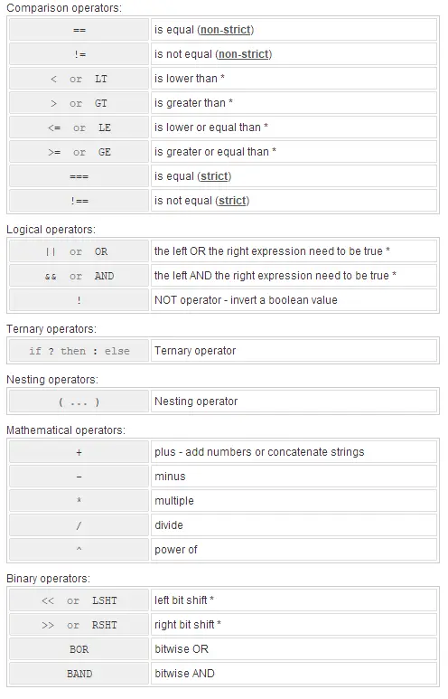
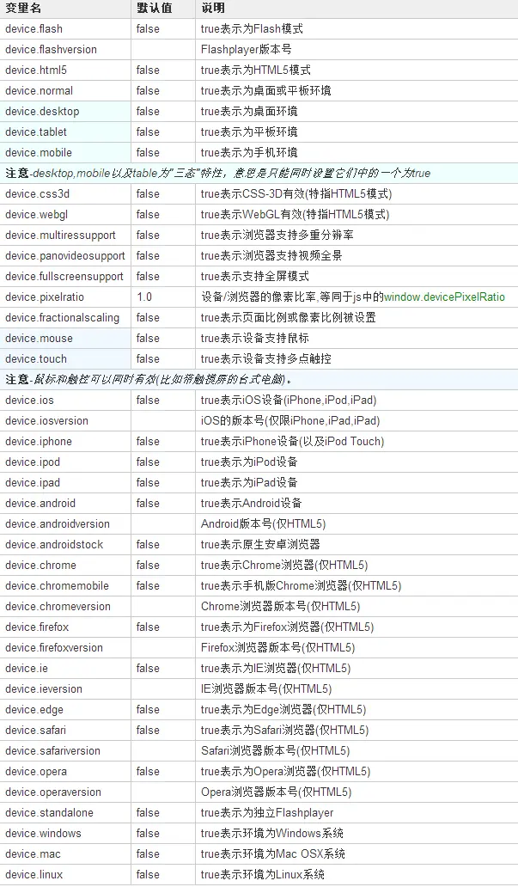
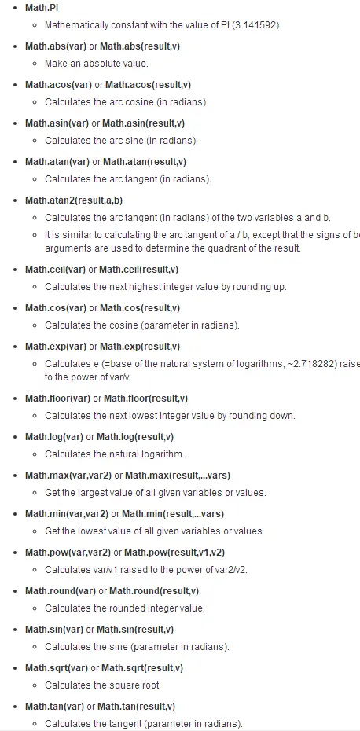
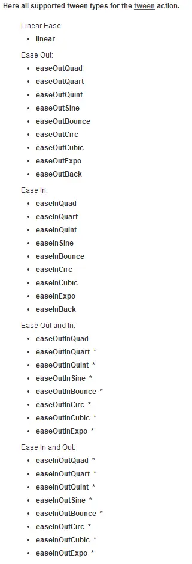
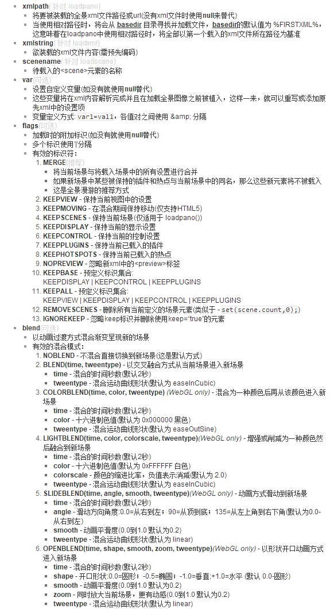
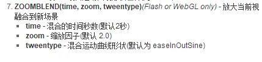
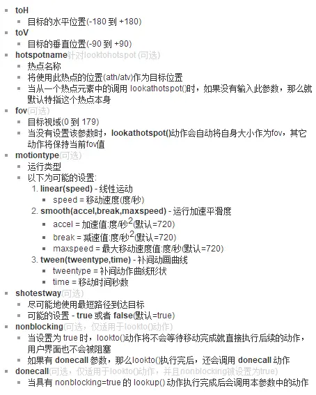
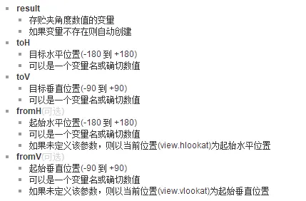
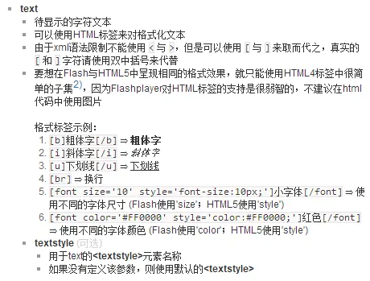

## action 脚本语法

### 语法及使用

`actionname(parameters); ...`

*   语法格式：动作名(参数);
*   动作名可以为以下几种:

1.  内置的krpano动作名…
2.  在xml任何地方定义的action元素名…
3.  包含动作代码的变量/属性名。

*   不在引号内（单或双引号字符）的空白字符（如空格，制表，新行）将被忽略。
*   可以同时编写若干条动作，只需在每条动作尾部加上';'字符。
*   动作将被逐条执行。
*   在动作调用之间及参数之间的空白(如空格、tabs以及换行)将被忽略。
*   参数数量取决于被调用的动作实体。
*   参数之间需要使用逗号','来分开。
*   要想在参数中使用空白或逗号，那么参数就需要用单引号或双引号进行封闭。
*   所有给定参数都视为字符。当使用变量名作为参数时，不会被自动解析为对应值。一些动作可以自动处理变量名参数，但是那要依赖与动作体本身。要想使用变量作为参量来传递，必须使用get动作。注 - 一些动作可以自动解析变量参数的值，但这仅限少数动作的自身特性。

### 表达式

表达式将被使用在：if语句；条件循环(for,loop)语句；和 calc 动作中。用于判断逻辑条件是否成立，计算数学表达式或拼接字符串。

*   基本语法：a 操作符 b
*   其中a或b项可以是变量，值或字符串。
*   操作符可以是下表罗列之一。
*   运算顺序取决于具体的操作符，但在等价操作符内运算顺序是从左向右。
*   可以使用括号实现一个自定义运算顺序 - 例如：（a 操作符 b）操作符（c 操作符 d）



```
.GT. 大于
.GE. 大于或等于
.LT. 小于
.LE. 小于或等于
.EQ. 等于
.NE. 不等于 .AND. 逻辑与
.OR. 逻辑或
.NOT. 逻辑非
.EQV. 逻辑等
.NEQV. 逻辑不等
运算符优先级由高到低顺序为:()→**→*或/→+或-→.GT.或.GE.或.LT.或.LE.或.EQ.或.NE.→.NOT.→.AND.→.OR.→.EQV.或.NEQV
```

### 数组

*   每个xml带name的元素是一个数组的 element / item。
*   xml元素的名称是数组的名称和名称属性定义数组元素的名称/项目。
*   一个数组在krpano总是一个对象数组。
*   这样的数组项对象可以包含任何类型的自定义属性/属性。
*   数组可以预先定义或定义在运行时动态地设置一个数组项值,当第一次设置项值,然后自动将创建一个数组。

**_静态XML语法: (在定义在xml结构)_**
`<array_name name="item_name" value="..." />`

**_动态行为的语法: (当访问或设置在运行时)_**
`array_name[item_name].value`
**数组可用方法：**

```
count    统计
sortby(attribute, parameters*)    排序
removearrayitem(name or index)   移除
```

### 事件

```
onclick:鼠标点击

onover:鼠标经过

onhover:鼠标停留

onout:鼠标移开

ondown:鼠标按下

onup:鼠标抬起
```

### count

`lensflareset[name].flare.count`

### index

`lensflareset[name].flare[...].index`

---

官方文档：https://krpano.com/docu/actions/

### 全局变量

#### 版本

**version：**（只读）版本信息

**xmlversion：**（只读）xml版本

**build：**（只读）构建时间

#### 鼠标、键盘

**mouse.x** （只读）相对于区域，坐标原点为area的左上角

**mouse.y** （只读）

**mouse.stagex** （只读）相对于屏幕，坐标原点为screen的左上角

**mouse.stagey** （只读）

**mouse.downx** （只读）相对于区域，存贮最后一次鼠标按下时的位置(右键或右键)，该值以area的左上角为原点。

**mouse.downy** （只读）

**mouse.clickx** （只读）相对于区域

**mouse.clicky**（只读）

**keycode：** 0 （只读） 键码

**wheeldelta：** 0（只读）滚轮的标准滚动值，在大多数系统上通常为 +3(前滚) 或 -3(后滚)

**wheeldelta\_raw：** Number.NaN
（只读）未缩放未取整前的原始滚动值，注意：在flash模式下，仅当在窗口模式(非全屏)且使用默认embedding脚本时才有效；而在html5下，始终有效。

**wheeldelta\_touchscale：** 0.0 （只读）虽然触摸设备没有鼠标滚轮，但是当双指缩放时，仍然可能触发onmousewheel事件，该变量将提供相对的比例缩放详细信息。

注意： 仅适用于触摸设备！在其他装置上的值将永远是0。

#### 屏幕信息/设置

**fullscreen:** false 该变量可以用来检查或更改全屏模式的当前状态。若变量被改变，说明全屏模式被改变。

例子

```
切换全屏状态
onclick="set(fullscreen,true);"
onclick="toggle(fullscreen);"
```

注意：

*   在使用该设置前，应该检查当前设备/浏览器是否支持全屏模式，这可以在静态xml中使用devices="fullscreensupport"或动态语句中使用device.fullscreensupport变量来完成。
*   由于Flash Player和HTML5安全限制，切换到全屏模式需要用户操作动作(如点击鼠标或按下键盘)，这意味着切换全屏模式需要在onclick或onKeyDown事件中进行。
*   当HTML5浏览器不支持全屏模式时(如iOS)，全屏设置将仅改变viewer的大小以匹配整个浏览器窗口的大小。由于技术限制，无法在IFRAME中及嵌套HTML中工作。
*   若尝试从IFRAME内部使用全屏模式，那么有必要在IFRAME的声明中加入allowFullScreen，以告诉浏览器该IFRAME是充许切换到全屏的。

例子
`<iframe ... allowfullscreen="true" mozallowfullscreen="true" webkitallowfullscreen="true"></iframe>`

**stagewidth/stageheight：**（只读）当前视图窗口的宽/高 单位像素

**stagescale：** 1.0 整体缩放比例设置 （html5）
该设置将缩放所有krpano的元素大小。

通过缩放所有元素，舞台尺寸(屏幕尺寸/分辨率)本身将反比例增加，比如stagescale=0.5时，舞台尺寸将为200%。
该默认值取决于具体的设备、浏览器、js的window.devicePixelRatio值，在桌面和平板上该默认值通常为1.0；在移动设备上通常为0.5。

这意味着，在移动设备上的元素大小通常为桌面和平板的一半。
要禁用该行为(例如要实现一些自定义的响应式布局)可以将下面代码放到第一个xml中。

```xml
<action name="mobilescale" autorun="preinit" devices="mobile">
mul(stagescale,2);
</action>
```

例子

```xml
<action name="mobilescale" autorun="preinit" devices="mobile">
    mul(stagescale,2);
</action>
```

**bgcolor：** 视图的背景颜色。在全景图像装载前的显示颜色；以及局部全景未覆盖区域的显示颜色。
当设置为有效的十六进制色值时（例如："0xFFFFFF"表达白色），那么一个使用该颜色的形状将作为背景在全景图后面呈现。
未设置或设置无效时，则表现为透明，并且将显示FlashPlayer的默认背景色(在html文件中修改)，当embedding设置中wmode="transparent"时将显示Html页面

仅限Flash：当设置时，它允许在全景图像“外部”使用鼠标进行导航（例如使用局部全景图时），并且它允许不同尺寸局部全景之间的正确混合。

#### 设备信息

**browser.useragent** 用户代理字符串，user-agent 字符串。等同于js的 navigator.userAgent（只读）

**browser.platform** 浏览平台，在HTML5中为platform字符串，等同于js的navigator.platform；在Flash中一直为“Flash”（只读）

**browser.location** 当前页面的完整url（只读）

**browser.domain** 域名（只读）

**browser.protocol** 协议（只读）

*   注：仅当使用默认的 embedding.js 时，以上变量才有效。



例子

```
if(device.html5, ...);
if(device.flash, ...);
if(device.android, if(device.flash, ...); );
if(device.iOSversion GT 5.1, ...);
```

#### 时间、随机值

**timertick** （只读）查看器启动到当前时刻经历的毫秒数

**random** 0.0-1.0 （只读）返回一个0到1范围内的随机值

**idletime** 0.5 设置当无人操作时，经过多少秒会触发 Onidle 事件

```
//示例-生成一个1到10之间的随机数
mul(val, random, 9);
add(val, 1);
roundval(val);
trace('random value=',val);
```

#### math常量

**Math.PI** 数学常数π（圆周率）的值(3.141592)

#### 键盘/按钮移动

这些变量可以用来设置移动视图。

它们的主要用途是键盘或按钮动作控制。

**hlookat\_moveforce** 0.0 小于0时向左旋转；大于0时向右旋转

**vlookat\_moveforce** 0.0 小于0时向上旋转；大于0时向下旋转

**fov\_moveforce** 0.0 小于0时放大；大于0时缩小

当用键盘控制全景时，这些变量会返回不同的数值(0、1或-1)。可以在自已的程序代码中读取或设置它们，用来判断键盘操作状态或实现自动旋转的效果。

旋转加速度、速度及刹车速度分别取决于control.keybaccelerate、control.keybspeed、control.keybfriction

```
//示例-自动向左旋转3秒后停止
set(hlookat_moveforce,-1);
delayedcall(3,set(hlookat_moveforce,0));
```

#### 多重分辨率信息

**multireslevel** 当前的层级数(范围:0到image.level.count-1) （只读）

**lockmultireslevel：** 1 限定在某个层级，当为-1时取消限定。

**downloadlockedlevel：** false 为true时表示当前限定的层将被全部下载

#### 加载信息

**progress.progress：** 0.0 当前加载进度值(0.0~1.0)，它可以用来制作自定义加载动画，使用 onxmlcomplete 事件来启动加载动画，在 onloadcomplete 事件中停止它，加载过程中通过该变量的值来影响进度显示内容。

#### XML / 场景（只读）

**xml.url** (只读)当前加载的xml文件路径

**xml.content** (只读)当前xml文件的全部文本内容。当使用loadscene()方法加载一个场景后，该变量中的内容将仅为<scene>元素

**xml.scene** (只读)当使用loadscene()方法加载一个场景后，该变量存贮着当前场景的名称

**xml.view** (只读)保存当前xml或scene中<view>元素的一个备份。例如可以通过 xml.view.hlookat 来获取原始的 view.hlookat

*   注意-这里仅存贮明确定义的值，不含默认值，这意味着，在使用它取值之前要选检查一下该是否存在。

**network.viewerpath** krpano渲染器路径

**network.htmlpath** html路径

**network.firstxmlpath** 首次加载xml路径

**network.currentxmlpath** 当前xml路径

```
//例如
if(xml.view.fov !== null, ...);
```

#### 调试/错误处理

**debugmode** false 为true时显示调试跟踪 trace() 信息

**showerrors** true 当有错误发生时自动显示错误信息窗口

**lasterror** （只读） 用于在 onloaderror 事件中获取最近一次的出错信息。

**haveexternalinterface** true（只读）用来检测扩展接口功能是否有效。尤其是在使用 openurl()这个功能时，有必要使用该变量判断一下环境是否支持扩展接口。
浏览在网络服务器上的全景时该变量始终为true(扩展接口始终有效)，但是在本地的Flash模式下，只有在浏览器打开本地受信任文件夹中的Flash SWF文件，扩展接口才会有效。关于受信任文件夹管理，可以在Flasyplayer安全选项中进行。

**havenetworkaccess** true （只读）该变量用来检查网络访问是否有效。这可以用来避免错误的发生，如在使用谷歌地图或必应地图时，如若没有网络，就会发生未知错误。
浏览在网络服务器上的全景时该变量始终为true(网络访问始终有效)，但是在本地的Flash模式下，只有在浏览器打开本地受信任文件夹中的Flash SWF文件，网络访问才会有效。
关于受信任文件夹管理，可以在Flasyplayer安全选项中进行。

#### Layers (仅flash)

**image.layer** 仅as3用法)pano image layer 的 Actionscript 3 Sprite 对象

**layer.enabled / plugin.enabled** true 启用所有图层或插件

**layer.visible / plugin.visible** true 让所有图层或插件可见或不可见(也支持HTML5)

**layer.alpha / plugin.alpha** 1.0 设置所有图层或插件的透明度

**layer.layer / plugin.layer** (仅as3用法)layer / plugin 的 Actionscript 3 Sprite 对象

**hotspot.enabled** true 启用所有热点

**hotspot.visible** true 让所有热点可见或不可见

**hotspot.alpha** 1.0 设置所有热点的透明度

**hotspot.layer** (仅as3用法)hotspot 的 Actionscript 3 Sprite 对象

### 变量、语句

**定义一个变量或对象：**
`def(variable, type, value*)`

*   type

指定变量的类型
变量类型包括：

```
boolean - true 或者 false
number - 数字类型(含整数和小数)
integer - 整数类型
string - 字符类型
object -包含属性的对象类型
```

*   value(可选参数)

该变量的初始值
当未附初始值并且变量已存在时，那么该变量的当前值将被转换成给定的类型
当未附初始值并且变量不存在时，那么默认的初始值自动为以下内容：
boolean=false
number=NaN(表示 Not a Number)
integer=0
string=null
对象类型不能指定初始值

```
def(b, boolean, true);
def(n, number, 123.456);
def(s, string, 'text');
def(obj, object);
def(obj.x, number, 0.0);
def(obj.y, number, 0.0);
```

**赋值语句：** `set({variable},{value})`
_注意- 当这里为某个变量名称时，不会从该名称所表示变量自动取值，应该使用get(variable)来取变量值_

```
set(plugin[{name}].{attribute},{value});
set (layer[skin_map].visible, true);
```

**获取变量：** \`
get({variable}) 、 array\[ get(variable) \] 、 <xmlelement attribute="get:variable" ... />\`
获取给定变量的实际值
_注意- 个别内置动作会自动获取参数中变量名对应的实际值，这时就无需使用 get() 语句。比如 add() sub() mul()等_

```
set(dstvar, get(srcvar));
looktohotspot(get(name));
lookto(get(h), get(v), get(f));
showtext(get(msg));
tween(var,get(dstval));
set(pic, spot1);
set(hotspot[get(pic)].visible, false);
trace('xyz=', xyz, ' get(xyz)=', get(xyz));
txtadd(msg, 'fov=', get(view.fov));
```

**计算语句：**

```xml
calc(variable, expression)
action( calc(expression), ... )
array[ calc(expression) ]
<xmlelement attribute="calc:expression" ... />
```

expression：数学或逻辑表达式

```xml
set(y_new, calc(y_old - offset1 + offset2));
set(animationtime, calc('%1' == 'instant' ? 0.0 : 0.5));
<layer url="calc:'%CURRENTXML%/skin/' + settings.image1" />
```

**变量复制:** `copy(destination, source)==set(destination, get(source) )`
将原变量(source)中的值复制到目标变量(destination)中
当两个变量类类型不同时，原变量的值将被转换成目标变量的类型
copy()动作的同效语句为 set(destination, get(source));

```
copy(dstvar, srcvar);
copy(cur_hlookat, view.hlookat);
copy(layer[text].x, mouse.x);
copy(layer[text].y, mouse.y);
```

**变量移除:** `delete(variable,...)`
充许同时移除多个变量，变量之间使用逗号(,)分开即可

```
set(tmp1, ...);
set(tmp2, ...);
... do something ...
delete(tmp1, tmp2);
```

**判断语句：** `if(condition, then-actions, else-actions*)`
条件成立时执行相应 then语句，否则执行 else语句

```
if(fullscreen, fullscreensetup(), windowsetup() );
if(fullscreen, set(layer[controls].visible, false) );
if(i LT 10, loop(next) );
if(var === null, set(var,0));
if(hotspot[spot1] === null, trace(there is no spot1 hotspot));
if((varA GT 5) AND (varA LT 10),
    trace('varA is between 5 and 10')
  );
if(varA AND varB AND varC, trace('all vars are true') );
if(var1 GT var2,
    trace('condition is true');
    lookto(100,20,50);
  ,
    trace('condition is false');
    lookto(0,0,100);
  );
if(a*2+b GT (c+3)*1.5 OR teststring == '123', ...);
```

**反向判断：**`ifnot(condition, then-actions, else-actions*)`
逻辑上与 if 相反，用法相同。

**延时调用：** `delayedcall(delay , actions) / delayedcall(id, delay, actions)`
给定的时间后调用或执行指定的动作，为该动作指定一个唯一的标识 ID ，这样一来，就可以通过 stopdelayedcall(id) 来取消该延时动作的执行

```
delayedcall(5.0, hidelogo() );
delayedcall(id1,5.0, hidelogo() ); //id用于其他动作控制该delayedcall
delayedcall(10, looktohotspot(spot1);loadpano(pano2.xml); );
```

**移除延时回调：**`stopdelayedcall(id)`
取消并停止指定id的延时动作

```xml
<events name="introimage_events"
        onnewpano="delayedcall(introimage, 5.0, hide_introimage() );"
        onremovepano="stopdelayedcall(introimage);"
        />
```

**在某个actions后执行：**`nexttick(actions)`
在当前动作体(一个action元素结点内的动作集)执行完成后立即执行指定的动作

```xml
//执行以下动作会先显示"测试nexttick"
<action name="nexttick_test">
showlog();
nexttick(trace("这是nexttic中k的动作!");
trace("测试nexttick");
</action>
```

**在condition为真时执行指定actions：**`callwhen(condition, actions)`
当表达式(condition)值为 true 会执行指定的动作(actions)
若表达式的值此时不为 true ，那么该语句动作会一直等待，直到值为 true 并执行指定的动作
_注意- 与 if() 语句主要不同是，callwhen() 具有充许滞后特性，这里强调的是当表达式的值变为true时才执行且仅执行一次_

```
callwhen(plugin[video].loaded, plugin[video].playvideo(...); );
callwhen(plugin[maps].loaded, plugin[maps].setcenter(...); );
```

**循环语句：**`for(startactions, condition, nextactions, loopactions) //startactions循环前执行`
首先执行起始动作(startactions)，然后检查表达式(condition)，若值为 true 则执行要循环的动作(loopactions)，每执行一次循环动作就执行一次步进动作(nextactions)，然后再检查表达式的值，若为 true 则继续执行循环动作…直到表达式为 false 时终止循环

```
for(set(i,0), i LT 10, inc(i), trace('i=',i) );.
for(set(i,0), i LT layer.count, inc(i),
  trace('layer[',i,'].name=',layer[get(i)].name);
);
```

**持续循环：**`loop(condition, loopactions)` `asyncloop(condition, loopactions, doneactions*)`
只要表达式(condition)值为 true 则一直执行循环动作(loopactions)
对于 loop() 语句，只有当循环体执行结束后才会执行后续的其它动作；而 asyncloop() 则是在循环期间继续其它事件和动作，只是在当表达式为 true 时就每帧执行一次循环动作(loopactions)，asyncloop() 循环结束后还可以执行可选的完成动作(doneactions)

```
ondown="asyncloop(pressed, layer[scrollarea].scrollby(+2,0) );"
onover="asyncloop(hovering, updatemousepos(), hideinfo() );"
asyncloop(true, framehandler() );
```

**定时器**：`setinterval(id, delay, actions) 、 clearinterval(id)`
按给定的时间定时重复执行指定的动作

```xml
setinterval(time, 1.0,
    jsget(time, (new Date()).toLocaleTimeString(); );
    trace('time=',time);
  );
<events onkeydown="setinterval(get(keycode), 0.1, trace(keycode); );"
        onkeyup="clearinterval(get(keycode));"
        />
```

**切换：**`toggle(variable)`
针对指定逻辑变量的值，在 true 和 false 之间切换

```
toggle(fullscreen);
toggle(layer[button1].visible);
```

**交替真假：**`switch({variable})、switch({variable},{valueA},{valueB})`
转变变量的值

*   如果仅给一个变量，没有 value 参数，此时等效于 toggle() ，变量将在 true 与 false 之间变换 ；
*   如果给定两个或更多的 value 参数，那么将依次从左到右转变 variable 的值。

```
switch(fullscreen);
switch(layer[button1].visible);
switch(layer[button1].alpha, 1.0, 0.5);
switch(layer[child].parent, button1, button2, button3);
switch(destpos, -100, 0, +100); tween(y,get(destpos));
```

**跳出、中止：**`break()`
中断或停止当前的动作 ，当在 for()循环或 loop()循环中使用时，将仅停止循环自身
**调用绑定：**`callwith(caller, actions)`
可以使用指定的 plugin/layer 或 hotspot 作为调用者，用于直接访问这些元素的属性或事件

*   caller

该元素将作为调用者，只能使用 plugin/layer 或 hotspot 元素

*   action

任意动作语句，这些语句将在调用者的语境中执行，这意味着可以直接访问元素的属性和事件

```
//这里的onclick实际是指 layer[test].onclick();
callwith(layer[test], onclick);
callwith(layer[test], trace('test pos=',x,'/',y); );
//其中的alpha是指layer[test].alpha
callwith(layer[test], tween(alpha, 0.0); );
```

**style属性复制：**`assignstyle(elementname, styles)`

```
assignstyle(layer[test], 'teststyle');
assignstyle(layer[test], 'style1|style2');
```

将属性从一个或多个style元素的属性复制到目标元素。

**属性克隆：**`copyattributes(destobject, srcobject)`

将一个对象的所有属性从复制到另一个。
`copyattributes(get(layer[test]), get(style[style1]));`

**从所有`<events>`元素中执行指定的事件：**`events.dispatch(eventname, instantly*)`
instantly一个布尔值设置(true或false，默认为false)。当设置为true时，事件将被调用并立即执行，当没有设置或设置为false时，事件将在当前的操作调用后被调用。

```xml
<events name="events1" myevent="trace(events1...);" />
<events name="events2" myevent="trace(events2...);" />
...
events.dispatch(myevent);
```

### 计算相关方法

**数学运算符**
充许使用两到三个参数。

```
add(variable, valueA, valueB*)
sub(variable, valueA, valueB*)
mul(variable, valueA, valueB*)
div(variable, valueA, valueB*)
mod(variable, valueA, valueB*)
pow(variable, valueA, valueB*)
```

*   两个参数的情况

```
add(dst,val1) 等效于 dst = dst + val1
sub(dst,val1) 等效于 dst = dst - val1
mul(dst,val1) 等效于 dst = dst * val1
div(dst,val1) 等效于 dst = dst / val1
mod(dst,val1) 等效于 dst = dst % val1
pow(dst,val1) 等效于 dst = dst ^ val1
```

*   三个参数的情况

```
add(dst,val1,val2) 等效于 dst = val1 + val2
sub(dst,val1,val2) 等效于 dst = val1 - val2
mul(dst,val1,val2) 等效于 dst = val1 * val2
div(dst,val1,val2) 等效于 dst = val1 / val2
mod(dst,val1,val2) 等效于 dst = val1 % val2
pow(dst,val1,val2) 等效于 dst = val1 ^ val2
```

_提示-var1与var2可以是具体的值也可是变量，当为变量时，会自动使用它们的真实值_

```
set(val, 1);
add(val, 1);
trace('val should be 2: val=',val);
mul(doublewidth, width, 2.0);
mul(scale, 0.5);
div(result, vala, valb);
add(dst,rotate,360); tween(rotate,get(dst),5);
add(xpos, mouse.x, mouse_x_offset);
sub(destx, stagewidth,  destwidth);
div(aspect,16,9);
mod(cur_hlookat,cur_hlookat,360);
pow(sqrt,val,0.5);
```

**自增加：** `inc(variable, byvalue*, max*, min*)`

**自减少：** `dec(variable, byvalue*, min*, max*)`

*   variable

指定的变量

*   byvalue

每次增加或减少的量，如果无该参数，指定的量将被增加或减小 1

*   max / min

限定指定变量的最大值和最小值
当指定的变量达到其中一个限制时，该变量将被设置为另一个限制的值。这可以用来让指定的变量落在一定的范围或夹限在特定区域(使用 min=max)

```
inc(i);
inc(frame,1,get(lastframe),0);
inc(ypos,30);
inc(view.hlookat, 2, 90, -90);
```

**限定：**`clamp(variable, min, max)`
限制变量的值在给定的最小和最大之间的值。

*   variable

欲被裁剪的变量

*   min

最小值 - 当指定的变量小于该值时，将被设置与该值相同

*   max

最大值 - 当指定的变量大于该值时，将被设置与该值相同

```
clamp(percent, 0, 100);
screentolayer(bar, mouse.stagex,mouse.stagey, lx,ly);
div(fill, lx, layer[bar].pixelwidth);
mul(fill, 100);
clamp(fill, 0, 100);
txtadd(layer[barfill].width, get(fill), '%');
```

**数学函数：**`Math.*`
Math对象提供一些用于数学运算的常量和动作；
大部份 Math 动作都有两种使用方式：一是只提供一个变量作为参数，此时该参数即是运算对象，同时又是运算后结果的存贮变量；二是提供两个参数，前一个用于存贮结果，后一个为运算对象。



**数字取值（四舍五入）：**`roundval(variable, decimalplaces*)` //decimalplaces保留小位点位数，无此参数时表示不保留小数位(取整)

```
roundval(val);
roundval(val,2);
copy(cur_hlookat,view.hlookat);
mod(cur_hlookat,360);
roundval(cur_hlookat,2);
copy(cur_vlookat,view.vlookat);
roundval(cur_vlookat,2);
txtadd(msg,'looking at ',get(cur_hlookat),'/',get(cur_vlookat));
```

### 字符处理相关

**转16进制：**`tohex(variable, prefix*, length*)`
将给定的变量转换为十六进制字符串 ，可以用来生成 html/css 的色值字串

*   variable

给定的变量

*   prefix(可选)

前导字符(如 '0x' 或 '#')

*   length(可选)

返回值的长度

```
tohex(color,'#',6);
set(color, ...an_external_integer_input...);
tohex(color,'#',6);
txtadd(layer[text1].css,'color:',get(color),';');
```

**大小写转换：**`tolower(variable)`、`toupper(variable)`

**字符拼接：**`txtadd(destination, txt1, txt2*, txt3*, ...)`
若只有两个参数，则将第二个参数中的字符连接到目标变量(destination)的后面。多于两个参数时，则是将从每二个参数开始的所有参数依次连接在一起，并存贮到目标变量中

*   destination

用于存贮连接结果的目标变量
该变量不存在时将被自动创建

*   txt1,txt2,txt3,…(可选)

将被连接到一起的字符串
当只有一个txt参数时，该txt将被直接连接到当前目标变量(destination)的尾部
如果使用变量作为txt参数，一定要用get()来获取该变量的实际值

```
txtadd(picfilename,'%CURRENTXML%/pic_',get(pic),'.jpg');
txtadd(crop,'0|',get(ypos),'|333|285');
txtadd(pname, 'thumbbar_image_', get(i));
txtadd(layer[text].html,'[p]',get(data[txt1].content),'[/p]');
txtadd(msg,get(view.fovtype),'=',get(fov),'°');
```

**字符截取：**`subtxt(dstvar, srcvar, startpos, len)`

*   dstvar

用于存贮所提取子串的目标变量，如果该变量不存在则会被自动创建

*   srcvar

来源字符串的变量

*   startpos

子串在源字符串中的起始位置

*   len

欲提取子串的长度

```
subtxt(newvar, abcdefg, 2, 3)  ---->  newvar==bcd,  第二个开始截取，截取3字符
```

**字符串搜索：**`indexoftxt(index, txt, searchtxt, startindex*)`
返回搜索字符(searchtxt)在字符串(txt)中的起始位置(index)

*   index

用于存贮返回值的变量，若返回 -1 则表示搜索字符串(searchtxt)不存在字符串(txt)中；如果该变量不存在则自动创建

*   txt

源字符串

*   searchtxt

欲搜索的子字符串

*   startindex(可选)

指定从源字符串的搜索子串时的起始位置(默认为0)

**字符串替换：**`txtreplace(var, searchtext, replacetext)、 txtreplace(dstvar, srcvar, searchtext, replacetext)`
用字符串replacetext替换源字符串var/srcvar中的searchtext字符串

*   var / srcvar / dstvar

用于搜索的源字符串变量(var, srcvar)以及用于存贮返回结果的变量(var, dstvar)。如果该变量不存在则自动创建

*   searchtxt

将要被替换掉的旧字符串

*   replacetxt

欲替换旧字符串的新字符串

**字符串分割：**`txtsplit(string, separator, resultingarray)、txtsplit(string, separator, var1, var2, ...)`

*   string

欲分割的字符串，可以为实际的字符或字符串变量

*   separator

分割标记字符

*   resultingarray当用三个参数使用txtsplit()时

用于存贮分割结果的数组变量名，分割的字符逐个放个该数组成员的'value'属性中

*   var1,var2,…当用四个或更多参数使用txtsplit()时，分割出来的字符串将依次存入这些给定的变量中

```
Split into separate variables:
txtsplit('1|2|3', '|', a, b, c);
trace('a=',get(a), ' b=',get(b), ' c=',get(c));
Result:
a=1 b=2 c=3
Split into an array:
txtsplit('x|y|z', '|', arr);
for(set(i,0), i LT arr.count, inc(i),
  trace('arr[',get(i),'].value=',arr[get(i)].value);
);
Result:
arr[0].value=x
arr[1].value=y
arr[2].value=z
```

**转码：**`fromcharcode(var, charcode)`
将一个Unicode字符编码值转换为字符并存入变量(var)中

*   var

用于存贮转换结果的变量

*   carcode

Unicode字符编码值
**转义和反转义：**`escape(var)、escape(var, text)`、`unescape(var)、unescape(var, text)`
对字符串进行编码、解码

*   var

无 text 参数时 - 该变量自身将被编码或解码；
有 text 参数时 - 该变量将用来存贮 text 编码或解码后的字符

*   text(可选)

将被编码或解码的字符串

### 动画

**动画语句：**`tween(variable, value, time*, tweentype*, donecall*, updatecall*)`

补间动作，通过动态改变指定变量值实现动画效果
颜色支持 当指定的变量名中含有'color'这个关键字时，那么它的值将自动解析为32位的ARGB色值并且单独处理每个颜色通道
多变量支持 可以同时处理多个变量，这时要使用'|'来分隔这些变量(variable)、值(value)和被间动作类型(tweentype)，当变量有多个，而只有一个值或补间类型时，那么所有变量将使用相同补间动作类型或被转变到相同的值，并且对于所有变量来说，time、donecall以及updatecall也都是相同的

*   variable

将被改变的变量
使用|字符来分隔多个变量
当变量名中含有关键字'color'时，变量值将被处理为32位的ARGB色值

*   value

变量的目标值
若值前面有'%'字符，将按百分比方式处理
使用|字符来分隔多个变量对应的不同值
当使用变量来作为value参数时，需使用 get() 动作来获取变量的实际值

*   time(可选)

从当前值改变到目标值所需秒数(默认 0.5 秒)
还可以通过 distance() 语句来动态指定时间(不支持多变量补间)，distance()的原理是通过设置指定值域变化的最大时间来动态设置本次补间所需的实际时间，这样一来，对于变化量小的补量则用时短；相反对于变化量大的补间则用时就长，主要是改善用户体验。
下面是 distance() 语句用法

```
#distance(dvalue,dtime)
#dvalue - 值变化的区间
#dtime - 值在区间内变化完成需要时间
```

*   tweentype(可选)

补间动作的插值计算类型(默认 easeOutQuad )
更多补间动作类型：tweentypes

*   donecall(可选)

当补间动作完成且指定变量已达到目标值时，执行本参数中的动作
除了常规动作，还可以在这里使用特殊关键字 WAIT ，在这种情况下，用户界面以及后续的动作将被阻止，直到指定变量达到目标的值

*   updatecall(可选)

指定变量在每一次(每一帧)更新时，都会执行该参数中动作
_警告- 谨慎使用！会增加系统负担拖慢帧速率_

```
tween(view.vlookat, 90.0, 2.0); //视觉转为向上垂直90度，转换视觉过程为2秒
tween(layer[skin_scroll_layer].y, get(mh), 0.5, easeOutQuint, set(layer[skin_map].visible,false) );
//皮肤滚动条组件Y轴坐标改变到指定位置，转换坐标过程为0.5秒，转换模式为easeOutQuint，转换完成后执行set(layer[skin_map].visible,false)
```

**停止动画：**`stoptween(variable, ...)`
停止当前运行中的补间动作

*   variable

当前正在对该变量进行补间操作的动作将被停止

*   … variable, variable, …(可选)

将被停止补间的其它的变量

```
ondown="tween(layer[text].y, 10, distance(400,0.7), linear);"
onup="stoptween(layer[text].y);"
```

**动画类型tweentype：**



### 动态加载

**加载新的全景**
注意- 只有具备 keep=“true” 属性的图层、插件、热点、事件和光晕元素在新场景中才被保留

```
loadpano(xmlpath, vars*, flags*, blend*)
loadscene(scenename, vars*, flags*, blend*)
loadpanoscene(xmlpath, scenename, vars*, flags*, blend*)
loadxml(xmlstring, vars*, flags*, blend*)
```





_注意- 当选定的混合模式不被环境支持时(例如在Flashplayer下使用仅支持WebGL的模式)，那么将自动回退到默认的混合方式(NOBLEND)_

```
loadpano(pano2.xml);
loadpano(pano2.xml, null, MERGE, BLEND(1));
loadscene(scene1);
loadscene(scene1, null, MERGE, BLEND(1));
loadxml('<krpano><image><sphere url="pano.jpg"/></image></krpano>');
loadxml(get(data[xml].content), null, KEEPALL);
loadpano('%SWFPATH%/pano.xml', null, MERGE, BLEND(2));
loadpano(sphere.xml, image.hfov=1.0&view.limitview=fullrange);
```

**打开地址：**`openurl(url, target*)`

*   url

待打开的url

*   target(可选)

\_blank - 在新窗口中打开(默认)
\_self - 在当前窗口的当前帧中打开
\_parent - 在当前帧的父窗口中打开
\_top - 在当前窗口的顶层帧中打开
_Flash模式时要注意 - 该动作需要Flashplayer的扩展接口支持，它只在浏览器内部有效，当工作在离线或使用“file:“本地url浏览时就需要对Flashplayer进行安全设置_

```
openurl('http://krpano.com',_self);
openurl('help.html');
```

**调用js网页跳转：** `js(eval(this.location="{url}"))`

### 视图、相机控制

**视图设置：**`lookat(h, v, fov*, distortion*, architectural*, pannini*)`
观看全景的指定位置

*   h - 球面坐标中的水平方向角度(-180 到 +180)-view.hlookat
*   v - 球面坐标中的垂直方向角度(-90 到 +90)-view.vlookat
*   fov(可选) - 视域度数(0 到 179)-view.fov
*   distortion (可选) - 鱼眼扭曲设置 -view.distortion
*   architectural (可选) - 建筑投影设置 -view.architectural

pannini1)(可选) - pannini投影设置 -view.pannini

```
lookat(0,0);
lookat(0,0,90);
loadpano(pano.xml);
lookat(45.1, -20.2, 110.0);
```

**视图变化：**

```
lookto(toH,toV,fov*,motiontype*,shortestway*,nonblocking*,donecall*)
looktohotspot(hotspotname*, fov*, motiontype*, shortestway*)
moveto(toH, toV, motiontype*)
zoomto(fov, motiontype*)
```

将视图从当前位置移动给定的位置

_注意- 在移动期间所有用户界面及其它动作都将被阻塞，这意味着其它动作只能在当前动作完成后才能执行。可以使用 oninterrupt() 来充许用户中断该动作_



例子

```
moveto(100.0,5,linear(10));
zoomto(130,smooth());
lookto(33,-22,30,smooth(100,50,20));
looktohotspot(hotspot1);
looktohotspot(hotspot2, 40);
looktohotspot(hotspot3, 25, smooth(100,50,20));
looktohotspot(get(name));
```

**调整视图：**`adjusthlookat(desthlookat)` 调整view.hlookat值

解决360度环绕中到达目标水平位置(desthlookat)的最短路径

*   desthlookat

为 0 时，可以从 view.hlookat 中获取正确的当前水平位置值：-180 到 +180
为任意 0到360 的值时，则会修正从当前位置到达该水平位置的最短运动方式
可以直接使用变量，会自动获取实际值
此时当前的view.hlookat会被调整到与该参数的邻近值(不改变当前视图)

```
//用途一:让读取的view.hlookat值正确落在 -180到+180 的范围内
adjusthlookat(0);
trace(view.hlookat);
//用途二:修正view.hlookat，以期通过最短路径方式移动到目标水平位置
adjusthlookat(140);
tween(view.hlookat, 140);
```

**获得球面距离：**`getlooktodistance(result, toH, toV, fromH*, fromV*)`
获取球面坐标中两个位置之间的夹角度数(0到180度)



**停止 lookto / looktohotspot / moveto / zoomto事件：**`stoplookto()`
停止一个未阻塞的 lookto()/looktohotspot()/moeto()/zoomto()动作

**停止用户操作：**`stopmovements()`
立即停止用户触发的(通过鼠标、键盘或触控板)所有panning投影和缩放行为

**等待：**`wait(parameter)`
等待若干秒的时间或等待特定的事件(LOAD 或 BLEND)
_注意- 用户界面及所有后续动作将被阻塞，这意味着后面的动作只能在当前动作完成之后才能得到执行。可以使用 oninterrupt 以便让用户有中断能力_

*   parameter 有以下三种可能

任意数字 - 等待的时间秒数
LOAD - 一直等待直到加载完成
BLEND - 一直等待直到混合效果处理完成

```
oninterrupt(break);
lookto(150,30,70);
wait(3);
lookto(242,0,150);
lookto(280,-10,50);
wait(3);
loadpano(pano2.xml,null,MERGE,BLEND(2));
lookat(100,50,5);
wait(BLEND);
lookto(100,50,150);
```

**oninterrupt：**`oninterrupt(actions)`
在处理一些会阻塞用户界面的动作之前(如 lookto()、looktohotspot()、moveto()、zoomto()、wait()以及使用WAIT作为donecall参数的tween())，使用该语句，用户就可以随时通过操控界面(如点击动作)来中止这些动作的执行，同时执行参数内容中的动作。

*   action

用户中断后要执行的命令
另外这里还有一个特殊的命令：
break - 仅中断当前动作(无其它附加命令)
\## 坐标相关
**屏幕坐标和球坐标之间的转换：**`screentosphere(x,y, h,v)、 spheretoscreen(h,v, x,y, stereoside*)`
屏幕坐标与球面坐标之间的相互转换

*   screentosphere - 将屏幕上的x/y转换为球面中的h/v
*   spheretoscreen - 将球面中的h/v转换为屏幕上的x/y
*   x/y - 以左上角为原点的屏幕像素坐标
*   h/v - 球面上的方位角度(380×180)
*   stereoside (可选)

针对分屏VR模式 - 定义哪一边的屏幕坐标，可能的设置有两种：l- 左屏；r- 右屏；或者不设置表示无分屏的普通坐标

*   注意：

x,y,h,v必须为变量名，不充许使用确切的数值
如果变量未定义，它将被自动创建
`screentosphere(mouse.x, mouse.y, toh, tov);`

**屏幕坐标和球坐标之间的转换，层的坐标：**`screentolayer(layer, screenx,screeny, layerx,layery)`、`layertoscreen(layer, layerx,layery, screenx,screeny)`
在真实屏幕与相对图层坐标之间转换

*   layer - 图层元素名称
*   screenx/screeny - 屏幕上相对左上角的坐标像素值变量
*   layerx/layery - 相对于左上角的图层坐标变量

**注意：**
屏幕坐标系是从左上角 (x=0; y=0) 到右下角 (x=stagewidth; y=stateheight)
如果使能scalechildren，那么层坐标也会被缩放
不支持旋转的层
所有参数必须为变量，不充许使用常量
当变量不存在时，它将被创建

```
screentolayer(bar, mouse.stagex,mouse.stagey, lx,ly);
div(fill, lx, layer[bar].pixelwidth);
mul(fill, 100);
clamp(fill, 0, 100);
txtadd(layer[barfill].width, get(fill), '%');
```

**remapfovtype：**`remapfovtype(fov, srcfovtype, dstfovtype)、 remapfovtype(fov, srcfovtype, dstfovtype, width, height)`
就当前视域范围，重新计算出另一种fovtype对应的新fov值
在改变fovtype及重新计算对应fov的过程中，当前视域(镜头变焦)不会变化

*   fov

将被改变的fov变量
返回的新值也将存贮在该变量中

*   srcfovtype

当前的fovtype
可以是：HFOV,VFOV,DFOV或者MFOV

*   dstfovtype

新的fovtype
可以是：HFOV,VFOV,DFOV或者MFOV

*   bwidth (可选)

指定视图区域的宽度像素数
默认为当前视图尺寸

*   height (可选)

指定视图区域的高度像素数
默认为当前视图尺寸

```
set(view.fovtype, HFOV);
set(view.fov, 90);
...
set(view.fovtype, VFOV);
remapfovtype(view.fov, HFOV, VFOV);
```

### 更新重绘

**更新/重建pano对象的内部3D模型：** `updateobject(updateall*, updatefov*)`
重建全景对象的3D模型

在浏览时动态改变display.details以及display.tessmode后必须使用这个语句以更新全景。当在交互方式更改image.hfov,image.vfov或者image.voffset这些设置时，应使用updatefov=true试调用该语句，以便得到更新后的全景对象

_注意-该语句很消耗系统资源，请谨慎使用!_

*   updateall (可选)

针对多重分辨率 - 是否更新所有层
可能的设置：true 或 false (默认为 false)

*   updatefov (可选)

全景更新同时重新解析出新的image.hfov,image.vfov以及image.voffset
可能的设置：true 或 false (默认为 false)

```
set(image.hfov,1);
updateobject(true,true);
```

**屏幕重绘：**`updatescreen()`
直接强制重绘当前屏幕内容

**重绘屏幕，并重置idletime计数器：**`invalidatescreen()`
直接强制重绘当前屏幕内容，并全重置idletime计数(无用户交互时间计数)

### 热点添加及移除

**动态地创建和添加:**

```
addlayer(name)
addplugin(name)
addhotspot(name)
addlensflare(name, ath*, atv*)
```

动态创建一个新的图层、插件、热点或光晕

*   name - 待创建的新元素名称(最好使用小写英文,不要使用数字或其它字符开头)
*   ath/atv (仅针对光晕) - 光晕的空间位置

```
addlayer(button);
addhotspot(newspot);
addhotspot(polyspot);
addlensflare(sun, 20, -60);
```

**移除：**

```
removelayer(name, removechildren*)
removeplugin(name, removechildren*)
removehotspot(name)
removelensflare(name)
```

动态删除一个图层、插件、热点或光晕

*   name - 待删除的元素名称
*   removechildren (可选) - 设置为true时，该元素的所有子元素也将被删除

**layer/plugin/hotspot专属：**

```
layer / plugin / hotspot[name].loadstyle(name)
layer / plugin / hotspot[name].registercontentsize(imagewidth,imageheight)
layer / plugin / hotspot[name].resetsize()
layer / plugin / hotspot[name].updatepos()
layer / plugin / hotspot[name].changeorigin(align,edge)
layer / plugin / hotspot[name].getfullpath()
hotspot[name].getcenter(ath,atv)
```

### JS扩展

**调用js函数：**`js( "Javascript函数(参数)" )`

调用一个Javascript函数，在实际调用js代码之前，其中的参数将预先被krpano解析，记得要使用get(var)语句去获取变量的确切值
_Flash模式时注意 - 该语句需要使用Flashplayer的扩展接口，它仅在浏览器内部且在线时有效，当离线浏览或本地url浏览，那么就需要设置Flashplayer的安全设置项_

```
//以下是存在于js或 html文件中的Javascript代码
function test(p1, p2, p3)
{
  alert(p1 + ": " + p2 + " / " + p3);
}
//全景项目中的调用代码
js( test('Lookat', get(view.hlookat), get(view.vlookat)) );
```

**调用js代码：**`jscall( "...任意Javascript代码... ")`

直接在全景中执行任何Javascript代码，可以在Javascript代码中直接读写krpano的js接口对象
_Flash模式时注意 - 该语句需要使用Flashplayer的扩展接口，它仅在浏览器内部且在线时有效，当离线浏览或本地url浏览，那么就需要设置Flashplayer的安全设置项_

```
//改变html元素的风格
jscall('document.getElementById("test").style.display="none";');
//使用calc()语句构建js语句并使用krpano变量
jscall(calc('console.log("krpano version: ' + version + '")'));
//返回前一页面
jscall('history.back()');
```

**获取一个Javascript变量的值或一个Javascript函数的返回值：**`jsget(variable, ...Javascript代码... )`

获取Javascript变量或Javascript函数的值，可以在js代码读写krpano接口对象

*   variable

用于存贮返回值的变量名
如果变量不存在则自动创建
_Flash模式时注意 - 该语句需要使用Flashplayer的扩展接口，它仅在浏览器内部且在线时有效，当离线浏览或本地url浏览，那么就需要设置Flashplayer的安全设置项_

```
//得到当前页面的地址
jsget(ret, 'location.href');
trace('地址为：', get(ret));
//让用户输入内容
jsget(passwort, 'prompt("请输入口令")');
if(password == 'hidden', ...);
//得到当前日期(YYYY-MM-DD):
jsget(date, 'new Date().toISOString().slice(0,10);');
trace('日期为：', get(date));
js网页跳转： js(eval(this.location="{url}"))
调用软窗口： js(openWindow({url},{width},{height},{name},{yes/no}));
调用搜索查询窗口： js(openWindow(search.html,290,330,搜索查询,no));
提示窗口： js(alert({弹出窗口}));
```

### 调试

**是否显示输出日志：**`showlog(state*)`
显示或隐藏日志信息

*   state (可选)

true - 显示日志信息(默认)
false - 隐藏日志信息

**变量跟踪：** `debugvar(varname)`
在输出日志中显示/跟踪关于变量的详细信息（值和类型），当变量是一个对象时，也将显示所有对象属性。

**打印调试信息**

```
debug(...)
trace(...)
warning(...)
error(...)
```

将文本或变量输出到日志信息中

*   trace - 信息以”INFO:“开头(白色字体)
*   error - 信息以”ERROR:“开头(黄色字体)
*   warning - 信息以”WARNING:“开头(蓝色字体)
*   debug - 信息以”DEBUG:“开头(绿色字体)，并且仅在 debugmode=true 时才显示

_注意- 过多地输入跟踪信息会影响全景渲染效率，尤其不要在每一帧都有跟踪信息_

```xml
trace('view.maxpixelzoom=', view.maxpixelzoom);
<events onkeydown="trace('keycode=',keycode);" />
onresize="trace('size=',stagewidth,'x',stageheight);"
onclick="trace('mouse clicked at ', mouse.x, ' / ', mouse.y);"
trace('xyz=',xyz,' get(xyz)=',get(xyz));
```

**显示一个错误消息,并阻止用户交互:** `fatalerror(errormessage)`

*   errormessage

待显示的错误信息

### 文字

**显示文字（废弃）：**`showtext(text, textstyle*)`
在屏幕上显示字符串内容

*   注意：

1.  以前是内置语句，现在已由showtext.xml这个默认内含插件实现
2.  同一时刻只能显示一个字符串，再次显示新字符串时，当前字符将被清除



```
onhover="showtext(you are hovering me);"
onhover="showtext(style text,TEXTSTYLE);" //样式调用
onhover="showtext(line 1[br]line 2[br]line 3);" //分行
onhover="showtext([b]bold[/b] [i]italic[/i]);" //字体
```

### 汇总

官方地址：https://krpano.com/docu/xml/
