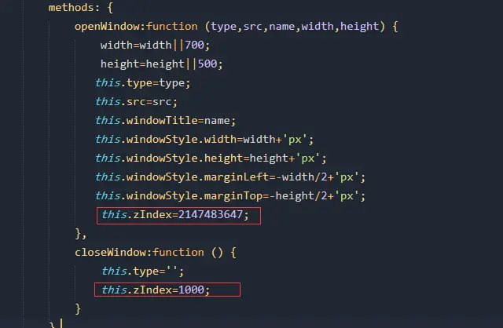

## 常用操作

### 层级问题

方法1.在html中可以使用最大z-index：2147483647避免全屏下弹窗被覆盖问题（慎用）
方法2：将弹窗生成在全景容器内



### 音乐

预加载MP3文件：`preloadsound({mp3});`

```
playsound: playsound({voice},{mp3},*{Cycle},*{execution});

playsound2D:   playsound2D({voice},{mp3},*{Volume},*{Track },*{Cycle},*{execution});

playsound3D:   playsound3D({voice}, {mp3},{ath},{atv},*{range},*{Volume},*{Cycle},*{execution});

playsound3DHS:
playsound3DHS({voice},{mp3},*{range},*{Volume },*{Cycle },*{execution});
```

暂停声音：`pausesound({voice});`

恢复声音：`resumesound({voice});`

暂停/恢复声音：`pausesoundtoggle({voice});`

停止声音：`stopsound({voice});`

停止所有声音：`stopallsounds();`

### 视频热点

**内部控制**

```
播放视频： playvideo({video});

关闭视频： closevideo();

停止：stop();

暂停： pause();

播放：play();

播放/停止：togglepause();
```

**外部控制**

```
播放视频：hotspot[{name}].playvideo({video});

关闭视频：hotspot[{name}].closevideo();

停止： hotspot[{name}].stop();

暂停： hotspot[{name}].pause();

播放： hotspot[{name}].play();

播放/停止：hotspot[{name}].togglepause();
```

### 全屏

切换全屏：`switch(fullscreen,true);`

进入全屏：`set(fullscreen,true);`

退出全屏：`set(fullscreen,false);`

### 键盘鼠标

**鼠标类型：**

```
移动到：set(control.mousetype,moveto);

2D拖拽：set(control.mousetype,drag2d);

3D拖拽： set(control.mousetype,drag3d);
```

**旋转缩放：**

```
放大：set(fov_moveforce,-1);

缩小：set(fov_moveforce,1);

停止缩放：(fov_moveforce,0);

向左：set(hlookat_moveforce,-1);

向右：set(hlookat_moveforce,1);

停止左右：set(hlookat_moveforce,0);

向上： set(vlookat_moveforce,-1);

向下：set(vlookat_moveforce,1);

停止上下：set(vlookat_moveforce,0);
```

**鼠标控制类型：**`control.mousetype`

### 场景

**前一场景：**
`_loadpano(%FIRSTXML%GigaMap/{scene_id}/scene.xml,MERGE,{blend})`

**后一场景：** `_loadscene(get(SSet.Next_Scene_ID));`
**场景调用：**

```
loadpano(%FIRSTXML%scene/{scene_id}/scene.xml,MERGE,{blend})
loadpano(pano2.xml);
loadpano(pano2.xml, null, MERGE, BLEND(1));
loadscene(scene1);
loadscene(scene1, null, MERGE, BLEND(1));
loadxml('<krpano><image><sphere url="pano.jpg"/></image></krpano>');
loadxml(get(data[xml].content), null, KEEPALL);
loadpano('%SWFPATH%/pano.xml', null, MERGE, BLEND(2));
loadpano(sphere.xml, image.hfov=1.0&view.limitview=fullrange);
```

**矩阵地图调用：** `loadpano(%FIRSTXML%GigaMap/{scene_id}/scene.xml,MERGE,{blend})`

### JS通信

**JavaScript 调用 Krpano 对象**

```js
embedpano({
    //省略其它不相关设置...
    id: "krpanoSWFObject",
    onready: krpanoReady
});
function krpanoReady() {
    var krpano = document.getElementById('krpanoSWFObject');
    var btn = document.getElementById('btn');
    btn.onclick = function() {
        krpano.call("webvr.enterVR()"); //进入VR
    };
}
```

krpano 对象默认 ID 为krpanoSWFObject，不过为了确定每次都能正常获取到，请在embedpano的onready函数中处理。

**Krpano JavaScript 接口对象**

```js
set(variable, value) - 将指定数值赋值给指定 krpano 对象
get(variable) - 返回指定 krpano 变量的数值
call(action) - 调用和执行任意 krpano 动作代码
spheretoscreen(h, v) - 直接调用 spheretoscreen 动作
screentosphere(x ,y) - 直接调用 screentosphere 动作
```

**Krpano 调用 JavaScript**

```
jscall("任何JS代码")
jscall("alert('11')")
jscall("window.funName()")
jsget(variable, "javascript code") //返回值所存储的krpano变量的名字，变量不存在则创建
```

**js获取任何标签的属性**

```js
function Getinfo() {
  var krpano = document.getElementById("krpanoSWFObject");
  var ath = krpano.get('hotspot[hotspot1].ath');
  var atv = krpano.get('hotspot[hotspot1].atv');
  alert("ath:" + ath+" atv:" + atv);
}
```

```xml
<hotspot name="hotspot1" url="http://www.new720.com/images/logo.png"  onclick="js(Getinfo())"  ath="0" atv="0" ondown="draghotspot();" />
```

Flash 注意事项
该动作需要 Flashplayer 的外部接口，这样在浏览器运行时才可用。本地或离线使用有file://的路径时，使用 Flashplayer 的本地/离线调用设置。

#### JS调用全景action(带参数)

在xml中编写一个action,如：

```xml
<action name="layerinfo">
trace(%1);
</action>
```

在页面中编写js脚本，如：

注意事项，embedpano中的ID名称和JS获取的ID名称要一致

```xml
<script type="text/javascript">
  var krpano = document.getElementById("krpanoSWFObject");
  krpano.call("layerinfo('New720.cn');");
</script>
```

### 获取中心坐标

方法一：

```js
var krpano = document.getElementById("krpanoSWFObject");

krpano.set("curscreen_x", window.innerWidth / 2);
krpano.set("curscreen_y", window.innerHeight/ 2);
krpano.call("screentosphere(curscreen_x, curscreen_y, curscreen_ath, curscreen_atv);");
ath = krpano.get("curscreen_ath");
atv = krpano.get("curscreen_atv");
```

方法二：

```js
var ath = krpano.view.hlookat;
var atv = krpano.view.vlookat;
```

### 全景视频

```xml
<krpano>
    <!-- include the videoplayer plugin -->
    <plugin name="video"
            url.flash="videoplayer.swf"
            url.html5="videoplayer.js"
            videourl="video.mp4|video.webm"
            />
    <!-- define the pano image and refer to the videoplayer plugin -->
    <image>
        <sphere url="plugin:video" />
    </image>
</krpano>
```

**方法：**
`plugin[video].playvideo('video2.mp4|video2.webm');`

### krpano tools使用

具体使用方法参考官网：https://krpano.com/docu/tools/
