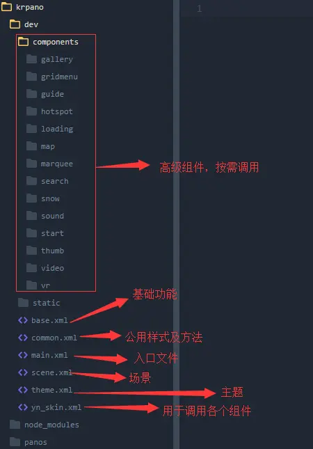
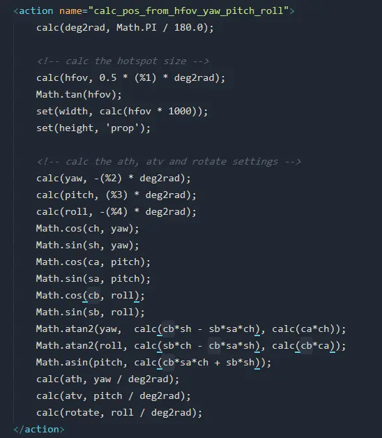

## 常用插件

krpano提供了一个小而简单的接口开发自己的插件，插件可以是Flash(. swf),Javascript(js),xml(xml)插件。
官网地址：https://krpano.com/docu/plugininterface/
可以自己开发插件，这里只介绍官方的免费插件

#### 建议

在日常开发中，需要定制高级功能的时候建议按照插件来开发，每个插件可单独配置、低耦合，在需要的时候引入文件即可，不对其他功能造成影响，以下是个人开发结构，为了减少请求数，通过构建工具自动监听文件变化，最终合并成一个主文件，上线也只需要此文件即可。
如果您有更好的方案或者其他想法也可以一起探讨。



### Combobox

首先需要导入插件`<include url="plugins/combobox.xml" />`
**创建静态列表框：**

```xml
<combobox name="box1" design="default" ...any layer settings...>
    <item name="item1" caption="Item 1" onclick="..." />
    <item name="item2" caption="Item 2" onclick="..." />
    <item name="item3" caption="Item 3" onclick="..." />
</combobox>
```

**动态创建列表框：**

```xml
<action name="test">
    addComboboxLayer(box1, default);
    set(layer[box1].align, 'lefttop');
    set(layer[box1].x, 20);
    set(layer[box1].y, 20);
    layer[box1].addItem('Item 1', trace(Item 1 clicked) );
    layer[box1].addItem('Item 2', trace(Item 2 clicked) );
    layer[box1].addItem('Item 3', trace(Item 3 clicked) );
</action>
```

**大小位置：**

*   位置类似layer一样通过align，edeg，x，y，parent来设置
*   如不设置宽度，将取item中的最大宽度
*   无需设置高度，高度总是自适应的

**属性/事件**

```
design="default"  设计方案
selecteditemindex  选中项的索引（只读）
onchange=""  选定项目改变时调用
item=""  包含的项目，数组格式，layer[cbname].item[itemname].*/layer[cbname].item.count
item[itemname].caption   项目的标题文本
item[itemname].onclick   项目的点击事件
```

**插件操作**

```
addComboboxLayer(name, design*)   添加列表框（名字，设计方案）
removeComboboxLayer(name)    移除
layer[name].addItem(caption, onclick)    添加项及对应事件
layer[name].addNamedItem(name, caption, onclick)    添加项，标题及对应事件
layer[name].selectItem(caption)    根据标题选择项
layer[name].selectItemByName(name)    根据name选择项
layer[name].removeAll()    移除所有项
layer[name].openList()    打开列表
layer[name].closeList()    关闭列表
```

**自定义设计方案**
通过 < combobox\_design >元素定义，具有以下属性

```
margin="2"   边距
open_close_speed="0.25"   打开/关闭速度(秒)
```

内部包含三个style元素分别设置容器，遮罩及项目的样式

```xml
<combobox_design name="default" margin="2" open_close_speed="0.25">
    <style name="combobox_container_style"
            bgalpha="1.0"
            bgcolor="0xFFFFFF"
            bgborder="1 0xFFFFFF 0.5"
            bgroundedge="1"
            bgshadow="0 1 3 0x000000 1.0"
            />
    <style name="combobox_marker_style"
            css="color:#FFFFFF;"
            bg="false"
            txtshadow="0 0 2 0x000000 1"
            />
    <style name="combobox_item_style"
            css="color:#222222;"
            padding="4 4"
            bg="false"
            bgcolor="0xC7E4FC"
            bgalpha="1.0"
            bgroundedge="1"
            txtshadow="0 0 1 0xFFFFFF 1.0"
            />
</combobox_design>
```

#### 此处有坑：combobox和action（calc\_pos\_from\_hfov\_yaw\_pitch\_roll）中cb变量冲突

*   combobox不能放在其他layer内，可以通过parent来指定父级
*   如果同时使用了最新版（1.19 pr13）的combobox 插件 及calc\_pos\_from\_hfov\_yaw\_pitch\_roll这个action 会出错，因为他们都使用了同一个变量 cb 。 只需要将calc\_pos\_from\_hfov\_yaw\_pitch\_roll中的变量改下名字就好。



---

官方文档：https://krpano.com/plugins/combobox/

### Videoplayer

**layer：**

```xml
<layer name="video"
        url.flash="videoplayer.swf"
        url.html5="videoplayer.js"
        videourl="video.m4v|video.webm"
        posterurl="videoposter.jpg"
        align="center" x="0" y="0"
        pausedonstart="false"
        loop="false"
        volume="1.0"
        onvideoready=""
        onvideoplay=""
        onvideopaused=""
        onvideocomplete=""
        onerror=""
        />
```

**3 d-distorted热点：**

```xml
<hotspot name="video"
          url.flash="videoplayer.swf"
          url.html5="videoplayer.js"
          videourl="video.m4v|video.webm"
          posterurl="videoposter.jpg"
          ath="0.0" atv="0.0"
          distorted="true"
          scale="1.0"
          rx="0.0"
          ry="0.0"
          rz="0.0"
          pausedonstart="false"
          loop="false"
          volume="1.0"
          directionalsound="true"
          range="90.0"
          rangefalloff="1.0"
          outofrangevolume="0.0"
          onvideoready=""
          onvideoplay=""
          onvideopaused=""
          onvideocomplete=""
          onerror=""
          />
```

**全景图像:**

```xml
<plugin name="video"
        url.flash="videoplayer.swf"
        url.html5="videoplayer.js"
        videourl="video.m4v|video.webm"
        posterurl="videoposter.jpg"
        panovideo="true"
        pausedonstart="false"
        loop="false"
        volume="1.0"
        onvideoready=""
        onvideoplay=""
        onvideopaused=""
        onvideocomplete=""
        onerror=""
        />

<image hfov="360" vfov="180">
    <sphere url="plugin:video" />
</image>
```

**属性：**

```
`videourl：`视频地址，一般就是MP4+webm，优先从左到右，可用preferredformat调整（MPEG4 / H264 (。 mp4,。 m4v。mov)- flash播放器/ Firefox(Windows 7 +)/ Safari和Chrome / IE Android / iOS /
WebM (.webm)——Firefox和Chrome
Ogg Theora (。 ogg,.ogv)- Firefox和Chrome
Flash视频 (。 flv,.f4v)——flash播放器
RTMP视频流 ( rtmp:/ / url)- flash播放器
HTTP流媒体直播 (。 m3u,.m3u8)——iOS,Mac Safari只——而且只有<层>用法,不是因为帕诺人——因为这个视频 iOS错误 !）

posterurl（html5）：封面，默认第一帧
panovideo （use_as_videopano 老版）：false是否用作全景视频
pausedonstart：false在一开始是否暂停
loop:false循环
volume：音量 0.0-1.0
muted（html5）：静音
playbackrate（html5）：1.0回放速度
directionalsound（flash）：3d声音音效
range（flash）：90.0
rangefalloff （flash）：1.0
outofrangevolume（flash）：0.0
preferredformat（html5）：格式优先
autopause（html5） ：true自动暂停视频当浏览器选项卡/窗口被隐藏
autoresume（html5）：false自动恢复视频的时候停顿了一下,然后通过隐藏浏览器选项卡/窗口
html5controls（html5）：false当启用(设置为true),显示浏览器内置的视频控件。
html5preload（html5）：auto预加载
buffertime（falsh）：0.1视频应该在开始之前加载/缓冲的时间
ignoremetadata（flash）：false
playsinline（html5）：true在移动设备上播放视频内联krpano(iPhone、iPad、Android)。当禁用,那么浏览器就可以最终在自己内部的放像机播放视频
iphoneworkarounds（html5）：true使工作区为iPhone视频支持(iOS版本iOS前10)。
touchworkarounds（html5）：true使播放通过触摸手机和平板设备的解决方案
```

**事件：**

```
onvideoready：准备就绪
onvideoplay：播放
onvideopaused：暂停
onvideocomplete：播放完成
onerror：错误
onneedtouch：需要触摸
ongottouch：触摸时
```

**状态（只读）：**

```
isvideoready
ispaused
isseeking
iscomplete
isautopaused
needtouch
videoerror
time
totaltime
videowidth
videoheight
loadedbytes
totalbytes
```

**操作：**

```
playvideo(url, posterurl, pausedonstart, starttime)
play()
pause()
togglepause()
stop()
seek(time)
```

---

官方文档：https://krpano.com/plugins/videoplayer/

### Scrollarea

```xml
<layer name="scrollarea"
        url="scrollarea.swf" alturl="scrollarea.js"
        parent="..."
        align="..." width="..." height="..."
        direction="all"      //方向h/v/all
        draggable="true"   //允许拖动
        mwheel="true"        //鼠标滚动
        onhover_autoscrolling="false"  //hover自动滚动
        overscroll="1.0"   //滚动超出
        friction="0.95"   //摩擦
        acceleration="0.08"  //运动加速度
        returnacceleration="0.15"  //回弹
        momentum="0.06" //动力加速度
        onscroll=""  //滚动回调
        />
```

**只读属性：**

```
loverflow (只读) loverflow =左溢
roverflow (只读) roverflow =对溢出
toverflow (只读) toverflow =顶部溢出
boverflow (只读) boverflow =底部溢出
woverflow (只读) woverflow =总宽度溢出
hoverflow (只读) hoverflow =总高度溢出
```

**事件**

```
onscroll //滚动
setcenter(x,y) //设置中心
scrolltocenter(x,y) //滚动到中心
scrollby(dx,dy) //设置滚动速度向量
stopscrolling() //停止滚动
```

---

官方文档：https://krpano.com/plugins/scrollarea/

### Gyro2（新）

使用手机/平板电脑设备的陀螺仪和加速度传感器来控制全景查看方向，相比旧版（gyro插件），此版本更快，相应更及时、准确、流畅，建议使用新版。

**支持：**
ios,android，windows phone只要设备本身有硬件支持都可以使用
**用法：**

```xml
<plugin name="gyro"
        devices="html5"
        keep="true"
        url="gyro2.js"  //引入插件
        enabled="false"   //是否启用陀螺仪
        camroll="true"  //根据设备旋转调整观看位置
        friction="0.0"   0.0-0.99或者auto  摩擦力，auto和zoom/fov/frame-rate有关
        touch_mode="full"  off(关闭)/horizontaloffset（横向）/full（全部）/disablegyro（）,触摸方式
        sensor_mode="1"  传感器类型
        softstart="0.5"  启用陀螺时，方向改变的时间，为0将立即使用gyro-tracked值
        autocalibration="false"  自动校准陀螺仪
        onavailable=""
        onunavailable=""
        onenable=""
        ondisable=""
        />
```

**属性：**

`sensor_mode：`传感器类型

*   0 =直接使用最新的可用的传感器数据。 没有内插或外推法。 根据sensor-time-intervals的浏览器 运动可以是不平稳的或平滑。
*   1 =最新之间顺利插入 可用的传感器数据。 这将给一个非常光滑但延迟运动。
*   2 =预测设备传感器数据之间的旋转,然后插入。
*   3 =推断最新可用的传感器数据 当前帧的时间。 这将给一个快速响应和平滑运动,但可以有抽搐 当外推/预测数据和实际运动不匹配。
*   4 =预测当前帧的旋转装置。 这将给一个快速响应和平滑运动,但可以有抽搐 当外推/预测数据和实际运动不匹配。
*   5 =预测设备旋转和推断 传感器数据从最新的事件当前帧时间。

**状态**

`isavailable="false"` 设备是否支持陀螺仪

**事件**

```
onavailable:   在支持陀螺仪的设备上调用
onunavailable：在不支持陀螺仪的设备上调用
onenable： 在陀螺仪启用的时候调用
ondisable： 在陀螺仪禁用的时候调用
```

**操作**
`resetSensor(hlookat, vlookat*)：重置陀螺仪方向`

### MoreTweenTypes Plugin

本插件作为tween方法的参数使用。
**Ease Out and In:**

*   easeOutInQuart
*   easeOutInQuint
*   easeOutInSine
*   easeOutInBounce
*   easeOutInCirc
*   easeOutInCubic
*   easeOutInExpo

**Ease In and Out:**

*   easeInOutQuad
*   easeInOutQuart
*   easeInOutQuint
*   easeInOutSine
*   easeInOutBounce
*   easeInOutCirc
*   easeInOutCubic
*   easeInOutExpo

#### 引入插件

```xml
<plugin url.html5="moretweentypes.js"
        url.flash="moretweentypes.swf"
        preload="true"
        />
```

### Gridmenu

#### 插件属性配置

**button(可选)**

*   是否展示显示和隐藏网格菜单的默认按钮
*   默认值=true

**padding\_top(可选)**

*   缩略图滚动区域的顶部边距
*   对手机端该边距将被设置为0
*   默认值=75

**padding\_bottom(可选)**

*   缩略图滚动区域的底部边距
*   对手机端该边距将被设置为0
*   默认值=75

**width\_margin(可选)**

*   缩略图滚动区域的左右边距
*   对手机端该边距将被设置为0
*   默认值=0

**grid\_bgcolor(可选)**

*   背景颜色
*   默认值=0x000000

**grid\_bgalpha(可选)**

*   背景透明度
*   默认值=0.7

**display\_title(可选)**

*   展示网格菜单标题
*   默认值=true

**grid\_title(可选)**

*   网格菜单标题
*   默认值=GRID MENU

**grid\_title\_css(可选)**

*   网格菜单标题的CSS样式
*   默认值=color:#ffffff;font-family:Raleway;font-size:35px;

**group(可选)**

*   是否按照分组安排缩略图
*   注意不在分组中的场景不会被展示
*   默认值=false

**current(可选)**

*   只展示当前分组的缩略图
*   默认值=false

**cat\_container\_height(可选)**

*   分组标题容器的高度
*   默认值=35

**cat\_container\_border(可选)**

*   分组标题容器的边框设置
*   默认值=0,0,1,0 0xffffff 1.00

**cat\_container\_title\_css(可选)**

*   分组标题的CSS样式
*   默认值=color:#ffffff;font-family:Raleway;font-size:25px;

**cat\_container\_title\_align(可选)**

*   分组标题的对齐位置
*   默认值=left

**cat\_container\_border\_height(可选)**

*   分组标题的底部边距
*   默认值=1

**display\_cat\_desc(可选)**

*   是否显示分组的描述
*   默认值=true

**cat\_desc\_css(可选)**

*   分组描述的CSS样式
*   默认值=color:#ffffff;font-family:Raleway;font-size:14px;text-align:left

**thumbs\_crop(可选)**

*   缩略图的CROP属性
*   默认值=0|75|240|150

**thumbs\_width(可选)**

*   缩略图的宽度
*   默认值=240

**thumbs\_height(可选)**

*   缩略图的高度
*   默认值=150

**thumbs\_padding(可选)**

*   缩略图的边距
*   默认值=25

**thumbs\_scale (可选)**

*   按照百分比为单位的最大缩略图尺寸
*   默认值=100

**active\_thumb\_border(可选)**

*   激活的缩略图的边框设置
*   默认值=3 0xffffff 1.00

**display\_thumb\_title(可选)**

*   是否展示缩略图标题
*   默认值=true

**thumb\_title\_align(可选)**

*   缩略图标题的对齐方式
*   默认值=bottom

**thumb\_title\_x(可选)**

*   缩略图标题的X位置
*   默认值=0

**thumb\_title\_y(可选)**

*   缩略图标题的Y位置
*   默认值=5

**thumb\_title\_css(可选)**

*   缩略图标题的CSS样式
*   默认值=color:#ffffff;font-family:Raleway;font-size:16px;text-align:left;

**thumb\_title\_roundedge(可选)**

*   缩略图标题的背景圆角设置
*   默认值=5

**thumb\_title\_background(可选)**

*   缩略图标题背景是否显示
*   默认值=true

**thumb\_title\_backgroundcolor(可选)**

*   缩略图标题背景颜色
*   默认值=0x000000

**thumb\_title\_backgroundalpha(可选)**

*   缩略图标题背景透明度
*   默认值=0.8

**thumb\_title\_border(可选)**

*   缩略图标题背景边框是否显示
*   默认值=false

**thumb\_title\_borderwidth(可选)**

*   缩略图标题边框宽度
*   默认值=1

**thumb\_title\_bordercolor(可选)**

*   缩略图标题边框颜色
*   默认值=0xffffff

**thumb\_title\_borderalpha(可选)**

*   缩略图标题边框透明度
*   默认值=1

**thumb\_title\_padding(可选)**

*   缩略图标题边距
*   默认值=3 10

**display\_thumb\_desc(可选)**

*   是否在缩略图上显示场景描述
*   默认值=true

**thumb\_desc\_css(可选)**

*   场景描述的CSS样式
*   默认值=color:#ffffff;font-family:Raleway;font-size:15px;text-align:center

**thumb\_desc\_bg\_color(可选)**

*   场景描述的背景颜色
*   默认值=0x000000

**thumb\_desc\_bg\_alpha(可选)**

*   场景描述的背景透明度
*   默认值=0.6

**thumb\_desc\_padding(可选)**

*   场景描述的边距
*   默认值=8 15

**loadscene\_flags(可选)**

*   Loadscene动作的flag参数
*   默认值=MERGE

**loadscene\_blend(可选)**

*   Loadscene动作的blend参数
*   默认值=BLEND(1)

**vcenter(可选)**

*   网格菜单是否垂直居中
*   默认值=false

#### 插件action

`rg_show_thumbs_grid(true/false)`:显示或隐藏网格菜单

可以选择不使用默认按钮，或者用下面代码来覆盖

`<layer name="thumbs_button" url="gridbut.png" keep="true" align="bottom" onclick="rg_show_thumbs_grid(true);" crop="0|0|45|45" y="15" zorder="101"/>`
