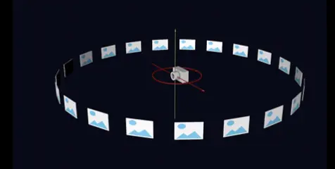
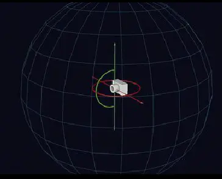

# Krpano全景漫游开发手册

> 声明： 本文档由作者收集整理，并非全部原创，如有侵权，请联系删除！另外由于Krpano本身内容较多，不可能面面聚到，如有不足，欢迎大佬指正。

## 概述

本文档基于版本1.19 pr14。

官网：https://krpano.com/

**概念**

全景漫游（英文：panorama）技术可以让体验者在全景图像构建的全景空间里切换视角的浏览。它是通过拍摄全景图像，再采用计算机图形图像技术构建出全景空间，让使用者能用控制浏览的方向，或左或右、或上或下观看物体或场景，仿佛身临其境一般。与传统的3D建模相比，全景漫游技术制作简单，数据量小，系统消耗低，且更有真实感。

早期270°或者360°全景漫游（柱状全景）：

720°全景漫游：

**全景图**

全景图（这里特指**球面全景图**）是指一种图片宽高比为**2比1**的包含了360°x180°空间的图片，例如8000\*4000的jpg图片或tiff图片等。
注：宽高比2：1为水平方向（360）：垂直方向（180）

**Krpano简介**

krpano是一款全景漫游制作软件和工具。其具有以下特点：

*   高度灵活、性能卓越的轻量化全景漫游浏览器。
*   兼容HTML5和Flash，支持Webgl下的WebVR展示。
*   使用专用的krpano xml代码编写全景漫游，可开发出高度定制化的项目，也可利用krpano工具开发在线全景制作及展示平台。
*   支持多种类型的全景图以及全景视频和环物全景。
*   支持多种投影模式。
*   同时提供简单高效的批处理方式，可在无需代码干预下迅速生成一个基本功能兼备的全景漫游项目。

**如何选择**

如果只想简单展示全景，无特殊定制需求，那么可以使用默认皮肤，或者使用全景平台进行开发。
如果需要开发全景平台、定制全景功能或者对全景开发有浓厚兴趣的可以学习和深入了解krpano。

**特性**

*   兼容Flash和HTML5
*   高性能和高质量的渲染
*   高度可定制的
*   丰富的全景格式和图像文件格式的支持
*   多分辨率
*   三维投影
*   虚拟旅游热点/脚本
*   渐进式

**案例展示**

见下载包或者[官方网站](https://krpano.com/examples/)

**目录**

1. [文件说明](1-structure.md)
2. [载入全景](2-load-panorama.md)
3. [Krpano XML 语法](3-krpano-xml-syntax.md)
4. [Krpano XML 内置元素](4-krpano-xml-built-in-elements.md)
5. [action 脚本语法](5-action-script-syntax.md)
6. [常用操作](6-common-operations.md)
7. [常用插件](7-common-plugins.md)
8. [skin_setting](8-skin-setting.md)
